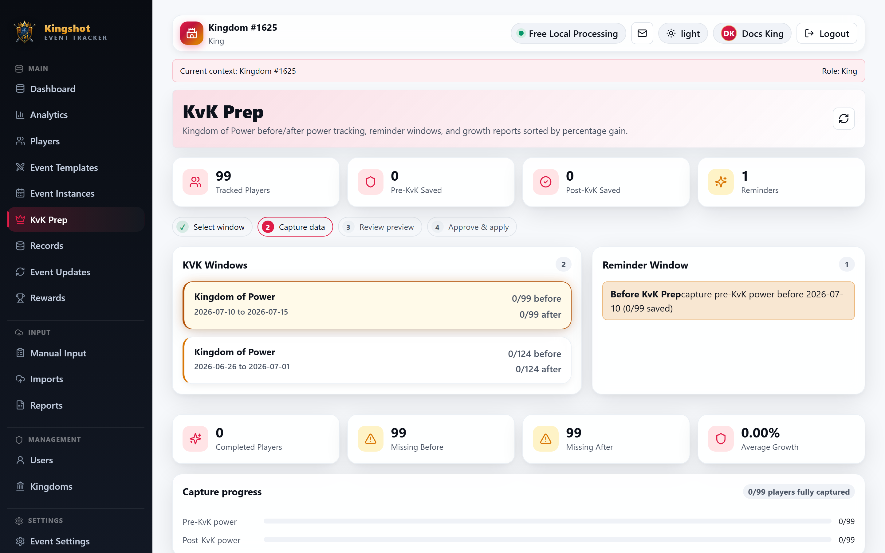

# Run a KvK Prep Session

KvK Prep is the dedicated before-and-after power workflow for **Kingdom of Power**. It is separate from normal event-result imports.

> Looking for KvK castle appointment applications and schedules? Use [Castle Positions](../castle-positions/overview.md), not KvK Prep.

## What this page is for

Use KvK Prep to:

- pick a Kingdom of Power window
- capture **before** power
- capture **after** power
- review growth
- export a PDF report

## Two ways to capture power

You can save data in two ways:

- **Manual Snapshot Entry** for typed power values
- **Screenshot Import** for alliance member list OCR

The screenshot path is careful by design: process the image first, review the rows, then apply them into the selected before or after snapshot.

## The basic workflow

1. Select the KvK window.
2. Choose **Before** or **After**.
3. Enter power manually or process an alliance member screenshot.
4. Review the preview rows.
5. Approve and apply them.
6. Repeat until both before and after coverage are complete.

## What the page helps you monitor

KvK Prep shows:

- tracked players
- how many before rows are saved
- how many after rows are saved
- reminder windows
- growth report sorted by percentage gain
- alliance summary, when you are not locked to one alliance

## Screenshot processing notes

For KvK uploads, the page supports:

- Terra Processor
- Henod Processor
- Gemini
- OpenAI
- paste from clipboard

After processing, you can:

- edit rows
- rematch rows
- accept rows
- ignore rows

Only then should you use **Approve & apply**.

## Export

The growth report includes a **Download PDF Report** action for sharing the final result.

## Related

- [Kingdom of Power](../events/kingdom-of-power.md)
- [Review Import Rows](../imports/review-rows.md)
- [Accept Rows (Apply an Import)](../imports/apply-import.md)
