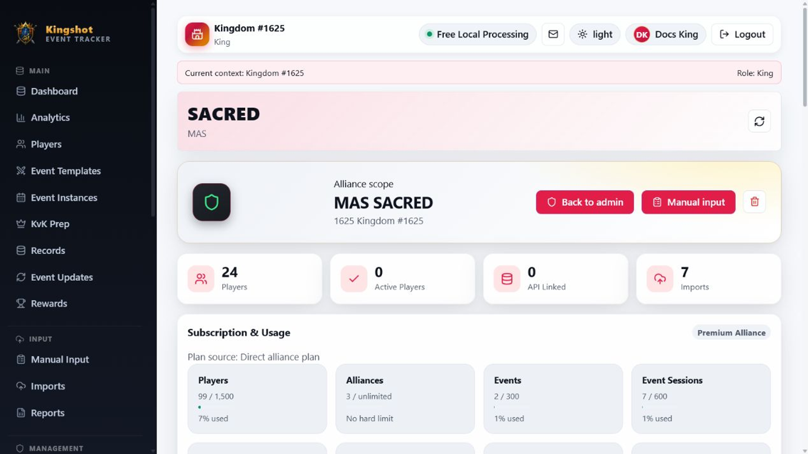

# Create & Manage Alliances

An alliance lives inside a kingdom. Use alliance management when you need to add a new alliance, rename one, review who is responsible for it, or inspect its players, imports, and reports.

## Create an alliance

The normal place to create one is the kingdom page.

1. Open the kingdom.
2. Find **Add Alliance**.
3. Enter the **Alliance name** and **Alliance tag**.
4. Select **Create alliance**.

## Open the alliance page

From the kingdom page, select **Open** beside the alliance you want.

The alliance detail page is the admin-facing version of alliance management. It is mainly for `Supreme Admin` and `King` users. `Alliance Leader` and `Co-Leader` use **My Alliance** instead.

## What you can do on the alliance page

- rename the alliance
- review player counts and API-linked counts
- review responsible users
- open player profiles
- review recent imports
- review recent reports
- delete the alliance when policy allows it

## Subscription note for alliance pages

You may see usage or premium information here too. The important short version is:

- paid access does not flow down automatically just because the parent kingdom has a paid plan
- an alliance gets paid benefits from its own direct subscription or from an accepted grant
- grant limits depend on the kingdom's current plan, so they are not fixed forever

This batch does not explain subscription rules in depth. That comes later in the subscriptions section.

## When to use this page instead of My Alliance

Use the alliance admin page when you are acting as a `Supreme Admin` or `King`. Use [Use the My Alliance Page](my-alliance.md) when you are acting as an `Alliance Leader` or `Co-Leader`.

## Related

- [Create & Manage Kingdoms](manage-kingdoms.md)
- [Use the My Alliance Page](my-alliance.md)
- [How Alliance Membership Works](../reference/alliance-membership.md)
- [Kick a Player from the Alliance](kick-player.md)
