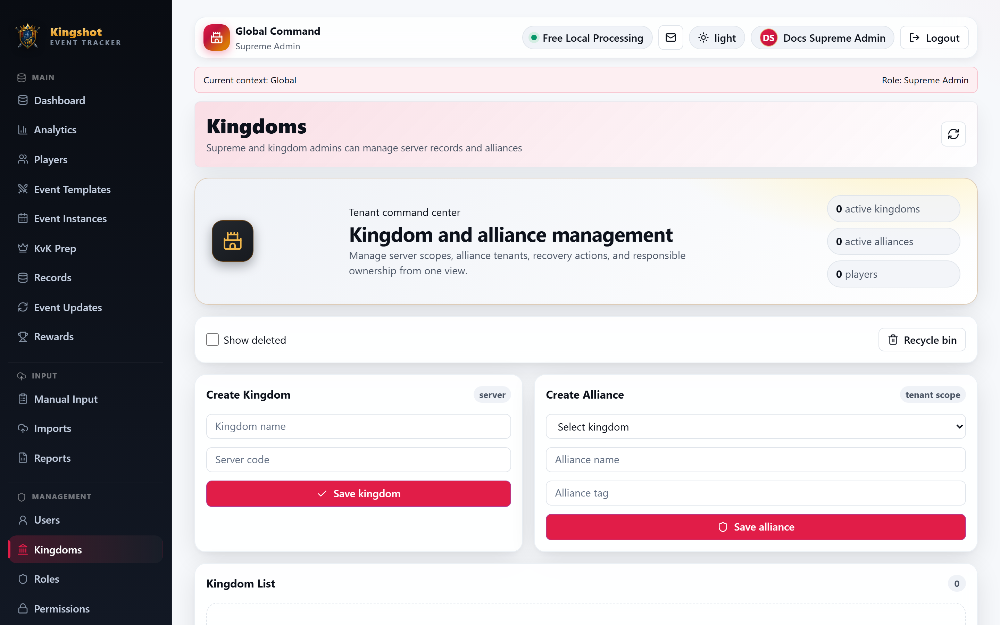
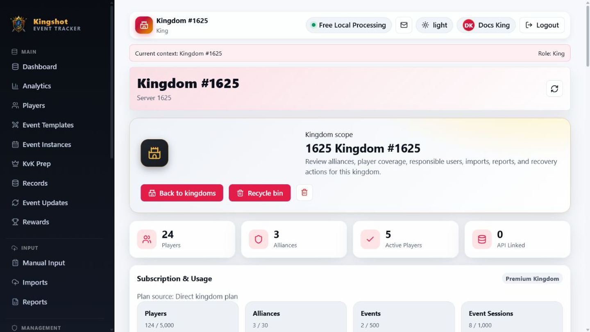

# Create & Manage Kingdoms

The **Kingdoms** area is the top-level management space for a server. It is where a `Supreme Admin` creates kingdoms and where a `Supreme Admin` or `King` reviews the kingdom's alliances, players, responsible users, recent imports, recent reports, and usage state.

## Who can do what

- `Supreme Admin` can create a new kingdom.
- `Supreme Admin` and `King` can open a kingdom they are allowed to manage.
- Kingdom work usually continues inside the kingdom detail page after creation.

## Create a kingdom

1. Open **Admin**.
2. In the **Kingdoms** section, enter **Kingdom name** and **Server code**.
3. Select **Add**.

After that, open the kingdom from the list to manage it in more detail.

## What you can do on the kingdom page

The kingdom detail page gives you one place to:

- rename the kingdom
- review player and alliance counts
- open the **Recycle Bin**
- add new alliances
- review responsible users
- spot recent imports and reports

## Read the page from top to bottom

The main sections are usually:

- a hero area with quick actions
- summary cards for players, alliances, active players, and API-linked players
- a usage panel
- **Kingdom Information**
- **Alliances**
- **Add Alliance**
- **Responsible Users**
- **Players**
- **Recent Imports**
- **Recent Reports**

## Subscription note for kingdom pages

You may see usage and premium-related information here. Keep these two rules in mind:

- A kingdom plan does not automatically give paid status to every alliance under it.
- Alliance grant limits are controlled by the kingdom's current plan, so those limits can change over time.

This guide only points out where you will see those signals. A later subscriptions section covers the rules in detail.

## Good practice

- Create the kingdom first, then add alliances under it.
- Use the kingdom page as the overview for server-wide cleanup and ownership checks.
- Open user management from here when the kingdom has no responsible users yet.

## Related

- [Create & Manage Alliances](manage-alliances.md)
- [Use the Recycle Bin](recycle-bin.md)
- [Assign or Remove Roles](assign-roles.md)
