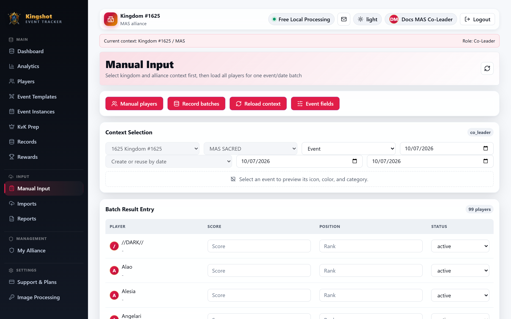

# Enter Results Manually

Manual Input is the fastest way to type one event/date batch directly without using screenshot OCR.

## What this page does

The page loads all players for one alliance, then lets you enter:

- score
- position
- participation status

for one event and one date at a time.

## Basic workflow

1. Choose the kingdom and alliance.
2. Choose the event and date.
3. If needed, choose an existing instance or let the app create or reuse one by date.
4. If the event uses stages, choose **Stage Data** or **Total Data**.
5. Fill in the player rows.
6. Save the batch.

After saving, the app opens the related record batch.

## Special event behavior

- staged events show **Stage Data** and **Total Data**
- cumulative events save dated running totals rather than stacking repeated totals

If the event uses stages and you stay in **Stage Data**, you must choose the stage/day.

## Useful shortcuts on the page

The page links directly to:

- **Manual players**
- **Record batches**
- **Reload context**
- **Event fields**

## Lock warning

If the related instance is locked, normal editing rules apply. Use [Locked Instances & Unlock Requests](session-lock.md) if late changes are needed.

## Related

- [Add Players During Manual Entry](manual-players.md)
- [Records & Record Batches](records.md)
- [Create an Event Instance](create-instance.md)
