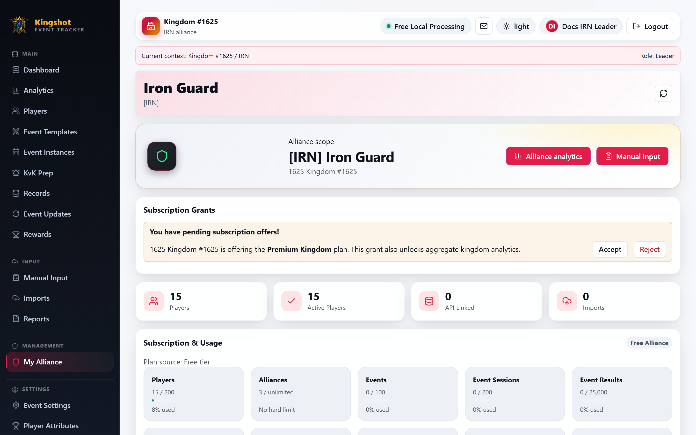

# Use the My Alliance Page

**My Alliance** is the main management page for `Alliance Leader` and `Co-Leader` users. It gives you a read-first overview of your alliance, plus the quick actions and offer decisions you are allowed to make.

## Open the page

Select **My Alliance** from the sidebar.

If you lead more than one alliance, the page shows a selector at the top so you can switch between them.

## What the page is for

Use **My Alliance** to:

- check alliance totals and recent activity
- open **Alliance analytics**
- jump to **Manual input** if your role has it
- review responsible users
- review players
- review recent imports and reports
- review subscription offers for your alliance

## What you will see

The page usually includes:

- a top selector when you manage multiple alliances
- a hero area with alliance name, tag, and quick actions
- a subscription offers area
- summary cards
- a usage panel
- responsible users
- players
- recent imports
- recent reports

## Subscription offers on this page

If your alliance has a premium offer from its kingdom, this is where you review it.

Depending on your permissions, you may be able to:

- accept the offer
- reject the offer
- revoke your own accepted access

Only accepted offers take effect. If there is no offer, the page still shows your current usage and plan situation.

## Suspension warning

If the parent kingdom is suspended, this page can show a warning banner. That means alliance actions may be blocked until the kingdom-level problem is resolved.

## Good practice

- Use this page as your alliance home base.
- Open player profiles from here when you need deeper player history.
- Review offers carefully before accepting, especially if your alliance already has its own direct subscription.

## Related

- [Create & Manage Alliances](manage-alliances.md)
- [Kick a Player from the Alliance](kick-player.md)
- [Browse & Filter Players](players-directory.md)
