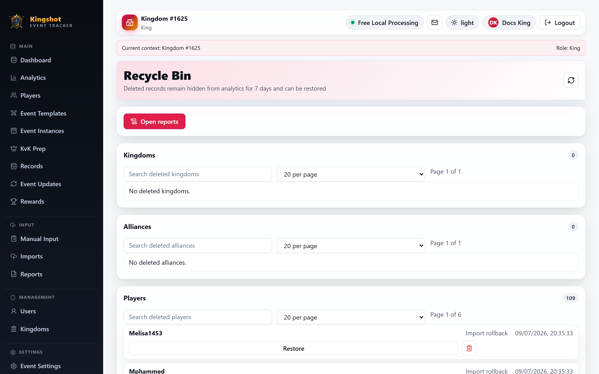

# Use the Recycle Bin

The **Recycle Bin** is where deleted kingdoms, alliances, players, events, imports, and results wait before permanent removal. It is the place to review what was deleted, restore it when allowed, or request help when you do not have direct restore rights.

Before using this page, read [What "Delete" Really Does](../reference/soft-delete.md). That guide explains the soft-delete idea. This page explains how to work with the bin itself.

## What you can browse here

The page is split into sections for:

- **Kingdoms**
- **Alliances**
- **Players**
- **Events**
- **Imports**
- **Results**

Each section works a little like its own mini list.

## Find what you need

For each section, you can:

- search within that item type
- switch page size to **20**, **50**, or **100**
- move with **Previous** and **Next**

This is especially useful when you are dealing with a large cleanup batch.

## Restore an item

If your role has restore permission for that item type:

1. Find the deleted record.
2. Select **Restore**.

The item returns to normal views after restoration.

## Request a restore instead

If you can view the bin but cannot restore directly, you may see **Request restore** instead.

Use that when you want an authorized admin to review the item and bring it back for you.

## Purge warning

Some senior roles can also purge items permanently.

Purge is different from restore:

- restore brings the item back
- purge removes it for good

Only purge when you are certain the item should never return.

## Good practice

- Search the correct section first so you do not restore the wrong item type.
- Restore before recreating something by hand whenever possible.
- Use the soft-delete reference when you need the bigger picture.

## Related

- [What "Delete" Really Does](../reference/soft-delete.md)
- [Delete & Restore Kingdoms/Alliances](delete-restore-kingdom-alliance.md)
- [Delete & Restore a Player](delete-restore-player.md)
