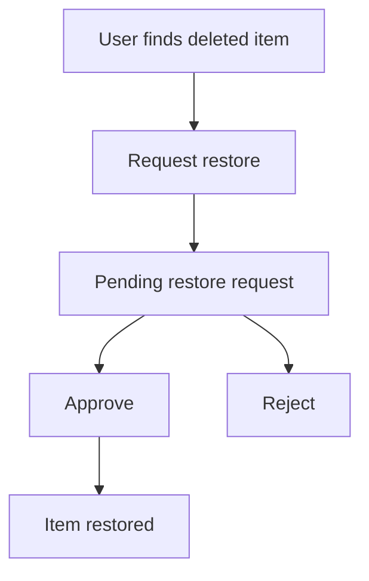

# Request & Approve Restores

This guide explains the restore-request flow for users who cannot restore something directly, and for the senior roles who approve those requests.

`King`, `Alliance Leader`, and `Supreme Admin` users are the usual approvers. Other users may only be able to file the request.

## The short version

If you can see a deleted item but do not have restore permission, use **Request restore**. An approver reviews it and either restores the item or rejects the request.

## Lifecycle

## For requesters

1. Open the relevant deleted item or bin area.
2. Choose **Request restore**.
3. Wait for an approver to review it.

## For approvers

1. Open the restore requests queue.
2. Review the item and the request context.
3. Choose **Approve** to restore the item, or **Reject** to refuse it.

## Related

- [Use the Recycle Bin](recycle-bin.md)
- [Delete & Restore a Player](delete-restore-player.md)
- [Delete & Restore Kingdoms/Alliances](delete-restore-kingdom-alliance.md)
