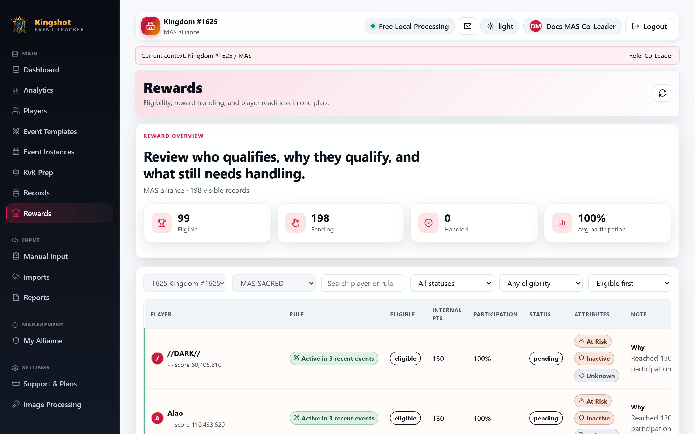

# Review Reward Eligibility

The **Rewards** page is the output step of the rewards workflow. It shows which players match your current reward rules and lets leadership track which cases were already handled.

This page is for everyone with reward viewing access, including `King`, `Alliance Leader`, `Co-Leader`, and alliance-scoped readers. If you need to change the rules behind the results, go to [Set Up Reward Rules](reward-rules.md).

## What this page is for

Use the Rewards page to:

- see which players are currently eligible
- compare eligible and not-eligible players
- read the rule that matched
- review [reward eligibility](../getting-started/glossary.md#reward-eligibility) details
- mark a reward as handled
- reopen it later if needed

This page does **not** define the rules. It only shows the results of the rules that were set up in [Reward Rules](reward-rules.md).

## What you will see

The page can include:

- scope selectors for kingdom and alliance
- search
- status and eligibility filters
- sorting options
- top summary cards such as eligible, pending, handled, and average participation
- a rewards table

Each row can show:

- player name
- matched rule
- whether the player is eligible
- internal points
- participation
- handling status
- player attributes
- notes or reasons

## Marking rewards as handled

`King`, `Alliance Leader`, and `Co-Leader` users can usually move a row between **handled** and **open** states.

That lets the page act as a simple follow-through tracker after prizes, recognition, or other rewards have been given out.

## How this connects to rules

Think of the workflow in two steps:

1. [Reward Rules](reward-rules.md) decides the standards.
2. **Rewards** shows who currently meets them.

If a result looks wrong, check the rule setup before changing expectations manually.

## Good practice

- Filter to eligible players first when you are preparing rewards.
- Use handled status so leaders do not duplicate work.
- Re-check the page after major imports or rule changes.
