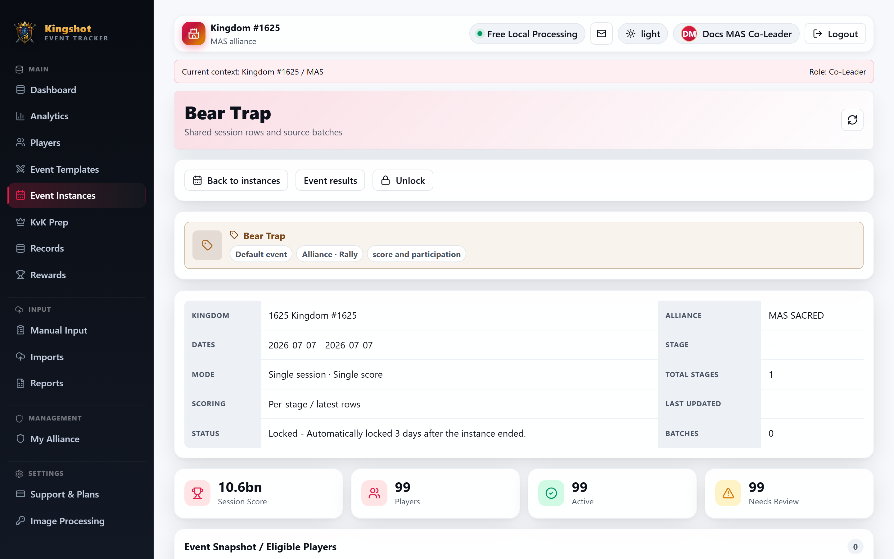
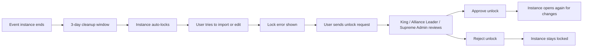

# Locked Instances & Unlock Requests

Instances do not stay open forever. After an event ends, the tracker gives a short cleanup window and then locks the instance to protect history from late changes.

## The rule

An instance auto-locks **3 days after it ends**.

After that:

- new imports are blocked
- edits are blocked
- manual cleanup is blocked

If you try anyway, you hit a lock error and need an unlock.

## The unlock flow

## What editors see

On a locked session, non-admin editors see a **Request Unlock** area with:

- a reason box
- a **Send unlock request** action

This is your chance to explain what still needs to be fixed.

## What reviewers do

An authorized reviewer can:

- unlock directly
- approve an unlock request
- reject an unlock request

## Good practice

- use the 3-day window for cleanup as much as possible
- explain exactly what needs fixing in your unlock request
- do not request unlock "just in case"

## Related

- [Work Inside an Instance](instance-detail.md)
- [Import & OCR Problems](../troubleshooting/imports.md)
