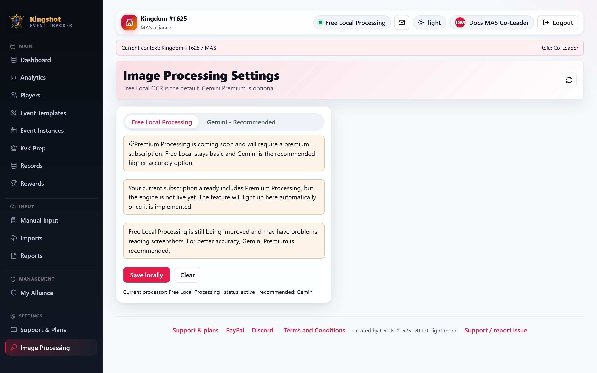

# Choose an Image-Processing Provider

The imports page lets eligible users choose how screenshot images are processed.

## Your four options

### Free Local Processing

Use Free Local Processing when:

- the screenshot is clean and readable
- you want the default option
- you do not want to use an external API key

This is the default path. It is good enough for many normal screenshots, but the app itself warns that manual review is recommended.

### Gemini

Use Gemini when:

- text is small
- names are harder to read
- the screenshot includes CJK characters or trickier formatting
- you want the strongest recognition quality

Gemini usually gives the best OCR results, but it requires **your own API key**.

### Free AI Extraction

Free AI Extraction is a personal-key fallback that uses OpenRouter vision models currently offered at no model charge.

- While the platform system key is active, this personal-key option is hidden.
- A Supreme Admin can suspend the system key, which makes Free AI Extraction visible.
- While suspended, each user must add a personal OpenRouter key in **Settings → Image Processing**.
- The app permits only `openrouter/free` or explicit model IDs ending in `:free`; it will not silently select a paid model.
- Free-model capacity and the selected underlying model can vary, so every import remains review-first.

To create a personal key when required:

1. Visit [OpenRouter Keys](https://openrouter.ai/keys).
2. Sign in or create an account.
3. Select **Create Key** and give it a recognizable name.
4. Copy the key and paste it into **Settings → Image Processing → Free AI Extraction**.
5. Keep the model as `openrouter/free`, save locally, and return to Imports.

### Premium Processing

Premium Processing is **coming soon**.

Right now:

- it may appear on the page
- it is not available as a working processing engine
- you should not plan an active workflow around it yet

## Quick guidance

Choose:

- **Free Local Processing** for quick, ordinary, readable screenshots
- **Free AI Extraction** for external vision processing without using Gemini
- **Gemini** for harder screenshots or when accuracy matters more
- **Premium Processing** never, for now, because it is not live yet

## Related

- [Set Up Your Gemini API Key](gemini-key.md)
- [Set Up Free AI Extraction](openrouter-free-ai.md)
- [Upload Screenshots](upload-screenshots.md)
- [Administer OCR Providers](../admin/ocr-settings.md)
