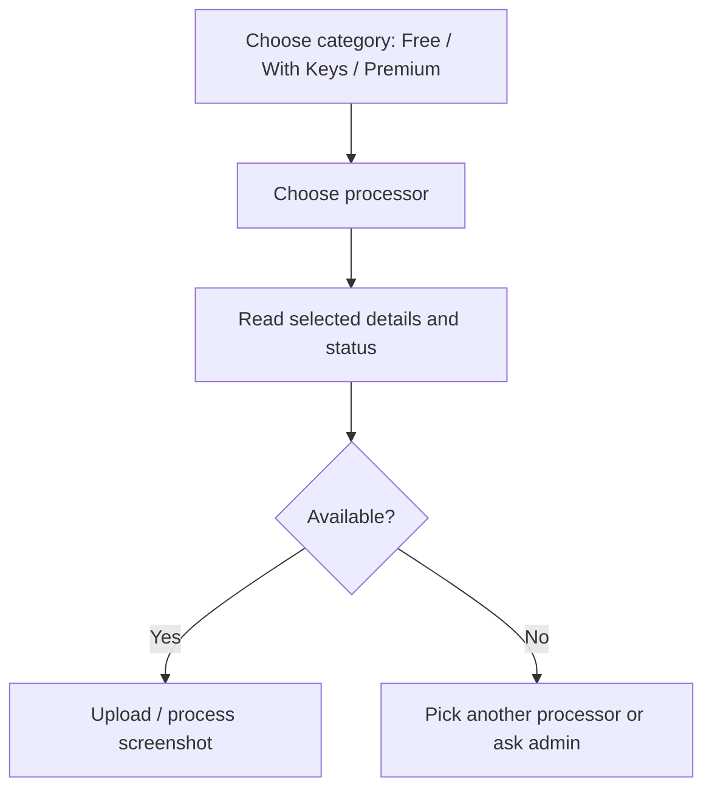

# Choose an Image-Processing Provider

The imports page lets eligible users choose which processor reads screenshot images. Processors are organized into exactly three user-facing categories: **Free**, **With Keys**, and **Premium**.

## Responsive behavior

On mobile:

- category selector fits as compact segmented controls or scrolls horizontally;
- processor selector is full width;
- the selected processor details card is compact;
- normal users see safe availability messages only;
- admin diagnostics are hidden from normal users.

On tablet:

- categories can appear in columns;
- details appear below the selected processor;
- diagnostics wrap instead of overflowing.

## Free

### Terra Processor

The built-in default. Nothing to set up.

- **+** Always available, no setup
- **+** Fast and free
- **+** Nothing to configure
- **−** Best on clear screenshots
- **−** Large numbers may need a check
- **−** Manual review recommended

### Henod Processor

A free platform service with no user key needed.

- **+** Free to use
- **+** No setup needed
- **−** May be temporarily unavailable

Normal users see a safe message if Henod is temporarily unavailable. Supreme Admins can inspect sanitized diagnostics in Processing Services.

## With Keys

Use your own personal processor key when you choose a With Keys option.

- **Gemini** - see [Set Up Your Gemini API Key](gemini-key.md)
- **OpenAI** - see [Set Up Your OpenAI API Key](openai-key.md)

## Premium

### Premium Processor

The platform-managed premium option. It appears as available when:

1. admin enables Premium Processor;
2. the selected/current scope includes Premium Processing;
3. the platform-managed service is ready;
4. the service is healthy.

If the service is unavailable, normal users see a safe technical-unavailable message. Administrators see safe service status only.

## Processor category flow

Every processor is review-first: detected rows are drafts until you accept them.

## One source of availability

The platform uses one availability state for the header chip, import picker, KvK picker, and settings. A processor that is unavailable is visibly unavailable and cannot be selected for a new import.

Henod may be temporarily suspended when it cannot accept work. In that case it is disabled for new work until a Supreme Admin re-checks it from **Processing Services**. The public message stays generic.

## Related

- [Upload Screenshots](upload-screenshots.md)
- [Review Rows](review-rows.md)
- [Premium Processing](premium-processing.md)
- [Processing Services](../admin/processing-services.md)
- [Processing Console](processing-console.md)
