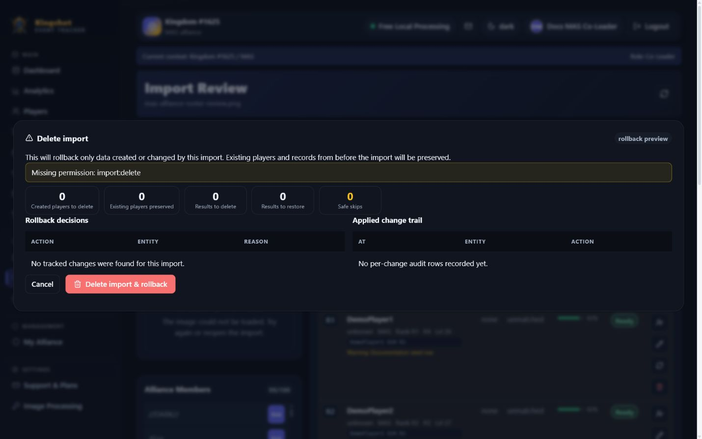

# Delete an Import & Roll Back Its Changes

Use delete-with-results when an already applied import was wrong and you want the tracker to undo the changes that import recorded.

## The walkthrough

1. Open the import.
2. Review the rollback impact preview.
3. Confirm **Delete import & rollback**.
4. The import moves to `rolled_back`.
5. It then lives in the Recycle Bin until restored or left deleted.

## What the impact preview is for

The delete dialog warns that rollback only targets data created or changed by this import.

That means the preview is there to show what the app believes it can safely undo before you confirm.

## What rollback really guarantees

The real guarantee is narrower than "rewind everything no matter what."

Today, rollback works like this:

- results created by the import can be removed
- overwritten results can be restored to their previous value **if nothing newer has changed them since**
- player field changes can be reverted **if the current value still matches what this import wrote**
- players created only by this import may be soft-deleted when safe

If something newer changed the same result or field after the import, rollback skips that piece instead of blindly erasing newer work.

## What rollback does not do

Rollback is not allowed to casually remove unrelated data from:

- other imports
- manual entry
- newer edits

That safety rule is why some overwritten values can be restored only when the current state still matches the import's own write.

## Plain delete vs rollback delete

Use plain delete only for imports you are discarding as imports.

Use **delete-with-results** when you need to undo tracked applied changes.

## Related

- [Restore a Deleted Import](restore-import.md)
- [Fixing Import Mistakes](import-mistakes.md)
