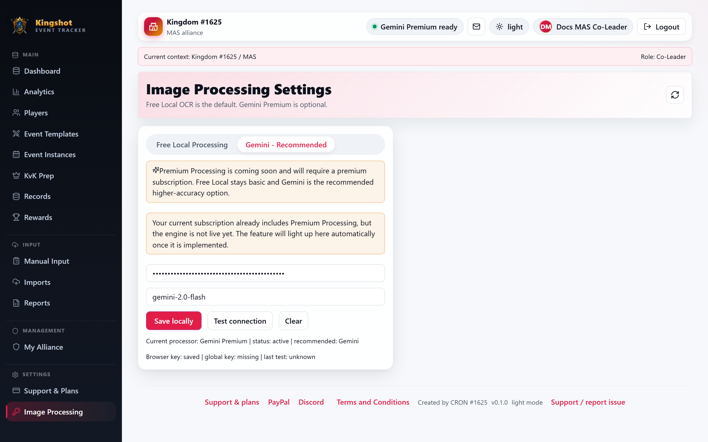

# Set Up Your Gemini API Key

Gemini can improve screenshot reading quality, but it needs an API key.

## The privacy detail that matters

Your Gemini key is stored **in this browser**, not on the server.

That means:

- it stays local to the browser you saved it in
- another browser or device will not automatically have it
- clearing local browser data can remove it

## Basic steps

1. Open **Image Processing Settings**.
2. Choose **Gemini**.
3. Paste your API key.
4. Select **Test connection**.
5. Select **Save locally**.

The page shows whether your browser key is saved.

## When to use a browser key

Use your own browser key when:

- you want Gemini quality right now
- you are working on a device you control

## If Gemini still looks unavailable

Check these common reasons:

- Gemini is disabled by admin
- the key was not saved in this browser
- the key test failed

## Related

- [Choose an Image-Processing Provider](choose-provider.md)
- [Administer OCR Providers](../admin/ocr-settings.md)
