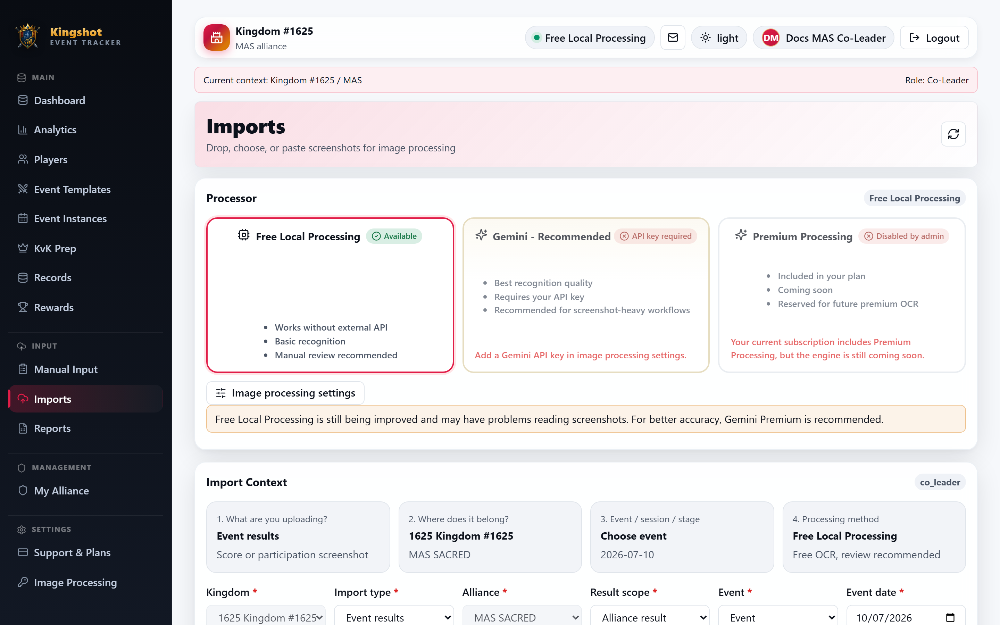
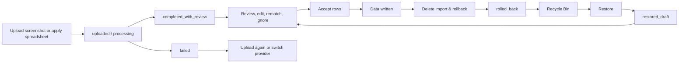

# How Screenshot Imports Work

Screenshot imports are built to be safe first. Uploading a screenshot does **not** immediately save live player results. It creates an import and a set of review rows that you check before accepting.

## The import lifecycle

## The seven import statuses

| Import status | What it means |
|---|---|
| `uploaded` | The file was received and is waiting for processing. |
| `processing` | OCR or import processing is running. |
| `completed` | Processed without the usual review landing state. This is a legacy or edge state. |
| `completed_with_review` | The import finished and its review rows are ready. This is the normal landing state. |
| `failed` | Processing failed. Use a fresh upload or remove the import. |
| `rolled_back` | The import's tracked applied changes were undone through delete-with-results. |
| `restored_draft` | The import was restored from the Recycle Bin and is back in editable review form. |

## Import types you will see

The imports area supports:

- alliance player/member-list screenshots
- alliance event-result screenshots
- kingdom event-result screenshots
- spreadsheet imports that end in the same review flow

## The most important rule

Uploading creates a draft-like review stage. **Accepting rows** is the step that writes live data.

That is why most import tasks split into:

1. upload
2. review
3. accept

## Side paths

- if processing fails, fix the source image or provider and upload again
- if an accepted import later proves wrong, use rollback through delete-with-results
- if you restore a rolled-back import, it comes back as `restored_draft` and must be reviewed again

## Related

- [Choose an Image-Processing Provider](choose-provider.md)
- [Upload Screenshots](upload-screenshots.md)
- [Review Import Rows](review-rows.md)
- [Delete an Import & Roll Back Its Changes](delete-and-rollback.md)
