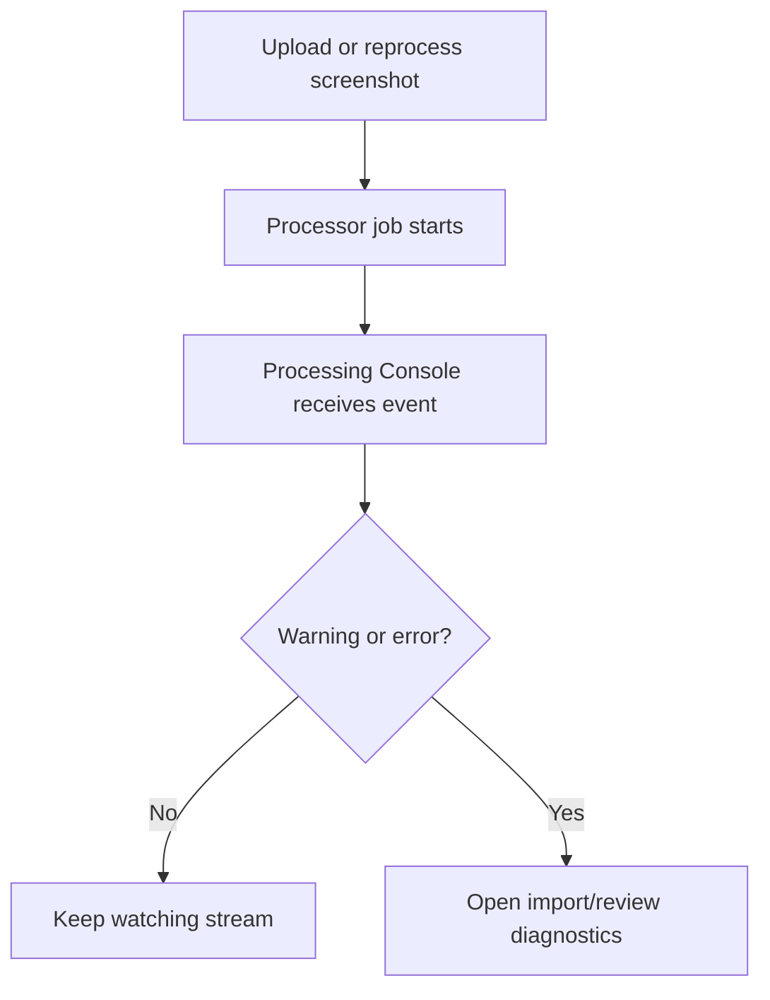

# Processing Console

## Purpose & Enhanced Capabilities

Use the Processing Console to inspect:

- **Live Processing Event Stream**: Real-time event logging across all active OCR and spreadsheet processing jobs.
- **Processor Advisory Handling**: Integrated advisory alerts highlighting key quota warnings, image parsing issues, and worker timeouts.
- **Job Diagnostics & Performance**: Detailed execution timings, import IDs, and exact error stack traces for failed jobs.
- **Filterable Severity Streams**: Multi-select filtering by processor provider (Terra, Henod, Gemini, OpenAI) and log severity level (Info, Warning, Error).

Configuration belongs in [Processing Services](../admin/processing-services.md), not here.

## Responsive behavior

On mobile and tablet:

- filters stack vertically;
- event rows wrap safely;
- copy buttons remain touch-friendly;
- the console does not horizontally overflow the page.

## Processing event flow

Processing Services is for service status and administrator controls. Processing Console is for the live processing stream. Platform Console is for broader platform activity.
