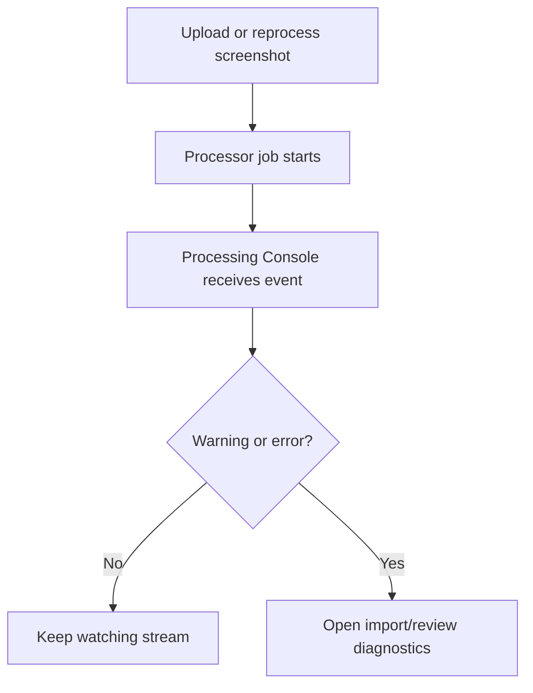
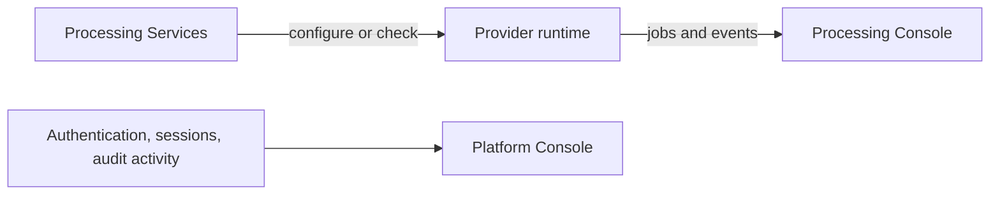

# Processing Console

Processing Console is the live processing event stream. It is separate from Processing Services.

## Purpose

Use it to inspect:

- OCR/import processing events;
- processor messages;
- recent job errors;
- import IDs and durations;
- filtered processor/severity streams.

Configuration belongs in [Processing Services](../admin/processing-services.md), not here.

## Responsive behavior

On mobile and tablet:

- filters stack vertically;
- event rows wrap safely;
- copy buttons remain touch-friendly;
- the console does not horizontally overflow the page.

## Processing event flow

## Visual boundary

This separation keeps an operational health check from looking like a log terminal, while preserving a dedicated live stream for processing work.
