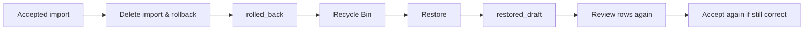

# Restore a Deleted Import

Restoring an import brings the import back for review. It does not instantly re-save all of its old live results.

> Screenshot placeholder: bin-restore-import.png
> Screenshot placeholder: import-restored-draft.png

## The restore path

## What restore does today

When you restore a rolled-back import:

- the import comes back as `restored_draft`
- its staging rows return
- rows with a matched player are usually put back into a ready-to-apply state
- rows without a matched player go back to a needs-review state

## What restore does not do

Restore does **not** directly revive the previously deleted live results.

Instead, it revives the import as a reviewable draft so you can:

- inspect it again
- fix it if needed
- re-accept only the rows that should be written back

## When to restore

Restore is useful when:

- the rollback was correct, but you still want the import as a working draft
- you want to re-review the rows with better judgment
- you want to re-apply only part of what was there before

## Related

- [Delete an Import & Roll Back Its Changes](delete-and-rollback.md)
- [Review Import Rows](review-rows.md)
- [Accept Rows (Apply an Import)](apply-import.md)
