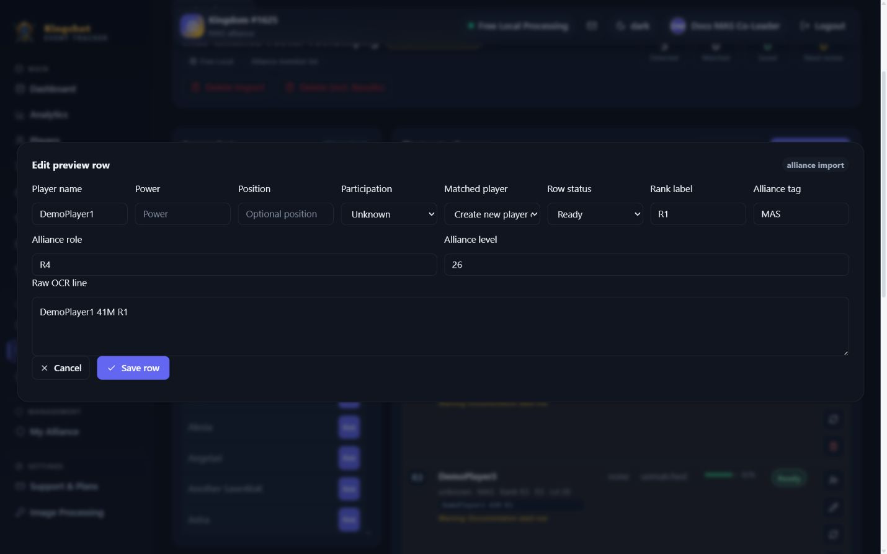

# Review Import Rows

The review page is where raw detected rows become trustworthy rows.

::: warning TODO screenshot

**Page:** Review Import Rows  
**Role:** User with access to this page  
**State:** Open the screen at the point described in the steps below  
**What should be visible:** The complete page, the action being explained, and any warning or confirmation message  
**Suggested filename:** `images/import-review-after.png`

:::

## What you can do here

From the review table, you can:

- filter rows
- accept one row
- accept all rows needing attention
- edit a row
- rematch a row against current players
- ignore a row
- restore an ignored row
- add a new preview row manually

## The four review filters

The row filters are:

- **All**
- **Needs review**
- **Saved**
- **Ignored**

These help you focus on the rows that still need work.

## The ten review-row statuses

| Row status | What it means |
|---|---|
| `ready` | A clean row waiting for accept. |
| `needs_review` | The app found something uncertain. |
| `unmatched_player` | No current player match was found. |
| `low_confidence` | OCR was unsure about the row. |
| `duplicate` | The same player appears more than once in the import. |
| `conflict` | A saved result already exists and accepting will overwrite it. |
| `ignored` | You set the row aside on purpose. |
| `accepted` | The row was accepted and saved against an existing player. |
| `created` | The row was accepted and a new player was created for it. |
| `saved` | The row is persisted through another save path. |

## What to check before accepting

Review:

- player name
- score or power
- match target
- confidence
- warnings
- status

If a row looks wrong, edit it first. If it should not be used, ignore it.

## Special warnings

- **Conflict** means accepting will overwrite an existing result.
- **Duplicate** means you should check whether one row is the accidental extra.
- **Unmatched** may mean the player is missing, renamed, or simply read badly.

## Related

- [Accept Rows (Apply an Import)](apply-import.md)
- [Fixing Import Mistakes](import-mistakes.md)
