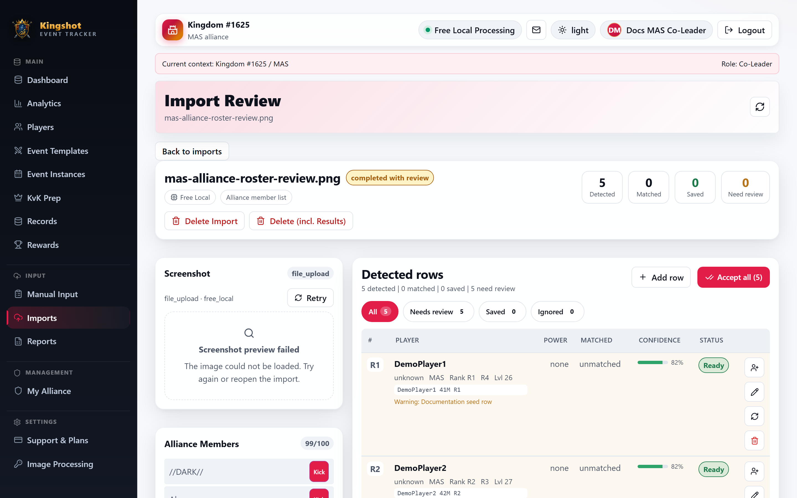

---
layout: home

title: Kingshot Event Tracker Documentation
titleTemplate: false

hero:
  name: "Kingshot Event Tracker"
  text: "Command the data. Understand every event."
  tagline: "Practical guides for players, alliance teams, Kings, import reviewers, and platform administrators. Now updated for mobile and tablet workflows."
  actions:
    - theme: brand
      text: Start with the basics
      link: /getting-started/what-is-the-tracker
    - theme: alt
      text: Mobile & tablet guide
      link: /roadmap/mobile-responsive-web
    - theme: alt
      text: Review an import
      link: /imports/overview
    - theme: alt
      text: Explore Castle Positions
      link: /castle-positions/overview

features:
  - icon: "⚔️"
    title: Getting Started
    details: Learn the tracker vocabulary, sign in, understand your dashboard, and find the right workflow.
    link: /getting-started/what-is-the-tracker
    linkText: Begin the quick start
  - icon: "🏰"
    title: "New Feature: Castle Positions & KvK Applications"
    details: Public player applications, UTC time choices, speedups and True Gold, Kingdom review, candidate comparison, slot scheduling, publication, and schedule changes.
    link: /castle-positions/overview
    linkText: Plan Castle appointments
  - icon: "📱"
    title: Mobile & Tablet Ready
    details: Use drawer navigation, stacked cards, scrollable tables, touch-friendly forms, and responsive consoles on phones and tablets.
    link: /roadmap/mobile-responsive-web
    linkText: Read responsive guide
  - icon: "🔎"
    title: Imports & OCR
    details: Upload screenshots safely, review detected rows, resolve conflicts, and apply only trusted data.
    link: /imports/overview
    linkText: Understand the import flow
  - icon: "📊"
    title: Analytics & Rewards
    details: Read alliance and kingdom analytics, inspect player trends, and review reward eligibility.
    link: /analytics/overview
    linkText: Explore analytics
  - icon: "🛡️"
    title: Subscriptions & Grants
    details: Understand effective plans, quota warnings, kingdom grants, allocations, and limited mode.
    link: /subscriptions/overview
    linkText: Read subscription guides
  - icon: "🧭"
    title: Troubleshooting
    details: Diagnose login, permission, import, missing-data, quota, and suspension problems.
    link: /troubleshooting/faq
    linkText: Find a solution
---

## Latest Updates

### 15–16 July 2026 System Update — Castle Positions and platform patches

::: tip New Feature
**Castle Positions & KvK Applications** gives a Kingdom one workflow for public applications, preferred UTC times, resource information, Minister/King review, suggestion-based candidate comparison, stage/position/time-slot planning, draft and published schedules, revisions, and conditional communication.
:::

The same update corrects login versus registration behavior, account/contact-email handling, password-reset matching, disabled-user visibility, Minister of Justice access, and subscription/usage loading and pagination.

[Read the complete 15–16 July 2026 System Update](/updates/2026-07-15-16-system-update) · [Open Castle Positions](/castle-positions/overview)

### Patch 2026-07-13 — Last 24h Platform, Security, Analytics, Console, Admin & Responsive Update

**Coverage:** the complete 12–13 July 2026 change window. This release updates responsive workflows, all processor categories and safe diagnostics, Processing Services/Console, the standalone Platform Console, analytics and premium visibility, administration, terms/privacy, upload safety, spreadsheet safety, accessibility, and documentation navigation.

- Private screenshots and import assets are available only to signed-in people with the correct scope.
- Spreadsheet imports now enforce stricter safety limits: file size, row count, column count, cell length, no formulas, no macros, no external links, and no legacy `.xls` files.
- Import previews and spreadsheet uploads are checked against the user's current kingdom/alliance scope before processing.
- Dialogs and high-use icon-only controls received accessibility improvements: dialog semantics, focus behavior, Escape handling, and explicit labels.
- The standalone Platform Console now ships the Glass TTY VT220 terminal font with readable monospace fallbacks; it no longer depends on a font being installed on the administrator's machine.
- Security dependency cleanup now reports `npm audit` with 0 vulnerabilities.

See:

- [Upload Screenshots](/imports/upload-screenshots)
- [Import a Spreadsheet](/how-to/spreadsheet-import)
- [Privacy, Security & Fair-Use Boundaries](/roadmap/privacy-security-and-fair-use)
- [Full 13 July patch notes](/updates/2026-07-13)
- [Complete 24-hour inventory](/updates/last-24h-change-inventory)
- [Current screenshot matrix](/updates/screenshot-matrix-2026-07-13)
- [Privacy and safety safeguards](/reference/security-and-deployment)

### Patch 2026-07-13 — Responsive UI, Admin Usability, and Console Updates

- Added mobile and tablet responsive layouts for dashboards, admin pages, analytics, imports, forms, modals, processor pages, and consoles.
- Replaced the mobile sidebar behavior with a touch-friendly menu drawer.
- Improved dense tables with horizontal-scroll affordances, stronger wrapping, and full-width admin layouts where needed.
- Reworked Users management into a full-width page with clearer create, filter, sort, pagination, and action areas.
- Made Processing Services, Processing Console, and Platform Console readable on phones and tablets.
- Updated processor diagnostics behavior: normal users see safe messages; Supreme Admins see safe service status.
- Updated documentation for responsive navigation, mobile import review, processor selection, console concepts, and admin workflows.

Current screenshots are captured after each page's data is visible and stable. The screenshot gallery shows the approved, sanitized captures used throughout the guides.

See:

- [Mobile & Tablet Guide](/roadmap/mobile-responsive-web)
- [Finding Your Way Around](/getting-started/navigating)
- [Choose an Image-Processing Provider](/imports/choose-provider)
- [Processing Services](/admin/processing-services)
- [Processing Console](/imports/processing-console)
- [Platform Console](/admin/platform-console)
- [Create and manage users](/how-to/create-user)

### Visual guide

The documentation uses sanitized real interface captures where they represent the current workflow and diagrams for permissions and user workflows. Screenshots never contain personal keys, session data, or private upload content.

## Most-used guides

  <a class="guide-link" :href="withBase('/how-to/players-directory.html')">Browse and filter players</a>
  <a class="guide-link" :href="withBase('/how-to/create-instance.html')">Create an event instance</a>
  <a class="guide-link" :href="withBase('/imports/upload-screenshots.html')">Upload screenshots</a>
  <a class="guide-link" :href="withBase('/imports/review-rows.html')">Review import rows</a>
  <a class="guide-link" :href="withBase('/how-to/rewards.html')">Review reward eligibility</a>
  <a class="guide-link" :href="withBase('/how-to/kvk-prep.html')">Run a KvK preparation session</a>

## Pick a reading path

| Your responsibility | Recommended starting point |
|---|---|
| Supreme Admin | [Platform Administration Overview](/admin/admin-overview) |
| King | [King Guide](/roles/king) |
| Alliance Leader | [Alliance Leader Guide](/roles/alliance-leader) |
| Co-Leader or import reviewer | [Co-Leader Guide](/roles/co-leader) → [Imports & OCR](/imports/overview) |
| Alliance Player | [Alliance Player Guide](/roles/viewer) |
| Subscription administrator | [Subscriptions & Usage Manager](/admin/subscriptions-dashboard) |
| Phone or tablet user | [Mobile & Tablet Guide](/roadmap/mobile-responsive-web) |

## Import screenshot flow

1. Upload a screenshot or spreadsheet as a draft.
2. Review names, scores, confidence, matches, and conflicts.
3. Correct, rematch, or ignore uncertain rows.
4. Accept only the rows that should become live data.

::: tip Review first
Uploading does not immediately write player results. The review screen is the safety boundary between detected data and saved data.
:::

## Plans, support, and the future

Use [Subscriptions & Usage](/subscriptions/overview) for current plan behavior and [Troubleshooting](/troubleshooting/faq) when something is blocked. The [Future Roadmap](/roadmap/README) is clearly separated from current features and contains planning ideas only.

