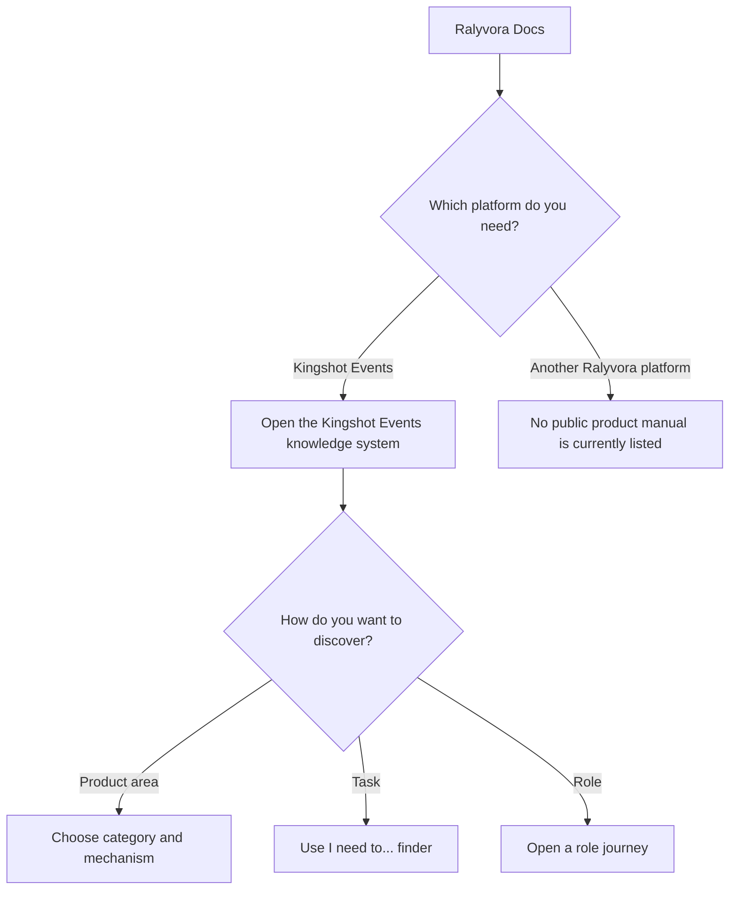

# Ralyvora Docs
<PortalHero />

## Choose a platform

<PlatformSelector />

```mermaid
flowchart TD
  A["Ralyvora Docs"] --> B{"Which platform do you need?"}
  B -- "Kingshot Events" --> C["Open the Kingshot Events knowledge system"]
  C --> D{"How do you want to discover?"}
  D -- "Product area" --> E["Choose category and mechanism"]
  D -- "Task" --> F["Use I need to... finder"]
  D -- "Role" --> G["Open a role journey"]
  B -- "Another Ralyvora platform" --> H["No public product manual is currently listed"]
```

*Ralyvora platform selection. The portal selects a documented platform before offering category, task, and role discovery.*

**Accessible summary:** Ralyvora Docs currently routes Kingshot Events readers into product-area, task, or role discovery and does not pretend that another platform manual exists.

## Featured starting points

<LinkGrid :items="[
  { title: 'Meet Kingshot Events', description: 'Understand the product, its scopes, and the workflows it connects.', href: '/kingshot-events/' },
  { title: 'Start as a player', description: 'Set up your profile, confirm your scope, and find personal tools.', href: '/kingshot-events/role-journeys/player-or-member' },
  { title: 'Manage a community', description: 'Review the safe, public workflows for alliance and kingdom managers.', href: '/kingshot-events/role-journeys/kingdom-manager' },
  { title: 'Get help', description: 'Resolve access, saving, imports, and feature-availability problems.', href: '/support' }
]" />

## What you can learn here

Ralyvora Docs explains how people use Ralyvora platforms, what information each workflow needs, what the platform produces, and what to try when something does not work. Kingshot Events is the only platform currently documented.

## Product areas

Kingshot Events covers scoped player records, event participation and scores, imports, analytics and rewards, Castle Position workflows, Knowledge Hub content, subscriptions, and planning tools in the Lab.

## Independent community platform

Ralyvora is an independent community platform. It is not officially affiliated with or endorsed by Kingshot or its publisher.

## Support and policies

Read [support options](/support), the [editorial policy](/editorial-policy), [privacy information](/privacy), and [terms](/terms).

## Related guides

- [about ralyvora docs](/about-ralyvora-docs)
- [support](/support)
