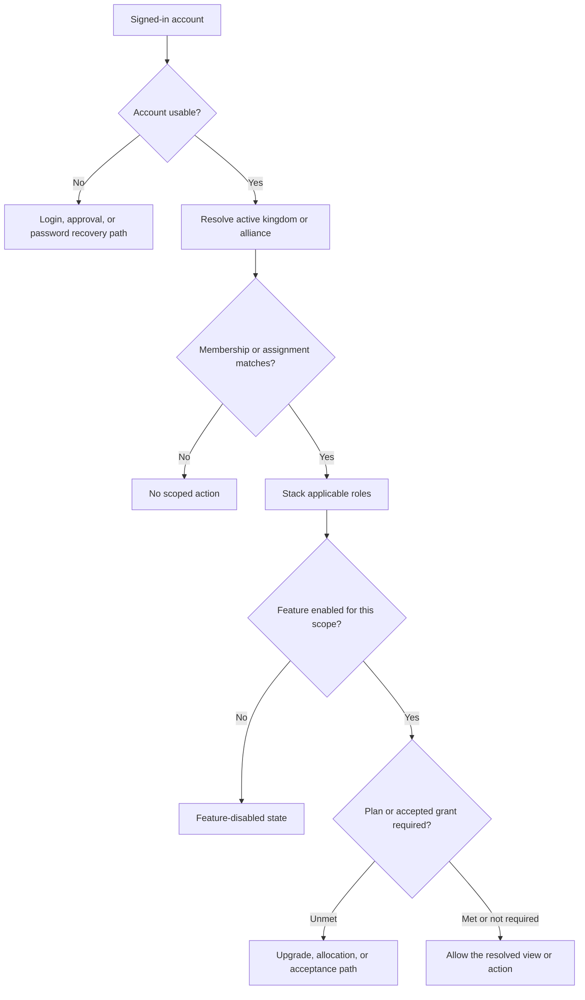

# Accounts and Access

<CategoryHero category="accounts-and-access" icon="shield" eyebrow="Access is a resolved outcome" title="Accounts and Access">
The platform does not decide access from a single role label. It combines account state, active scope, assignment or membership, stacked roles, feature availability, and any accepted subscription grant.
</CategoryHero>

<ProductFinder default-category="Accounts and Access" />

## The problem this category solves

An account answers who is signed in. A player link associates that account with a game identity. Membership places that player in a community. A management assignment authorizes work in a scope. A subscription or grant can enable a premium feature, but it does not turn a viewer into a manager. Keeping these concepts separate explains most cases where a page is visible but an action is not.

*Access resolution. Each gate answers a different question and produces a distinct recovery path.*

**Accessible summary:** A usable account is resolved against active scope, matching membership or assignment, stacked roles, feature availability, and premium entitlement. Failure at any gate explains the unavailable action.

## Role and scope effects

Roles stack rather than replacing one another. A person can be a player in one alliance, manage another permitted scope, and hold a kingdom responsibility. The active scope limits which of those responsibilities applies to the current page. Ownership adds control over records a user created, but ownership does not bypass a closed workflow, a published-version rule, or a missing scope assignment.

Cross-scope visibility is deliberately narrower than broad sign-in access. A kingdom manager may receive kingdom-wide views; an alliance manager normally works within the assigned alliance; a player sees personal or community information exposed to members. Shared or granted Analytics is read-only unless a separate management rule authorizes edits at the source.

## Main workflows

- [Registration and login](/kingshot-events/getting-started/first-visit) covers account creation, approval, password change, and recovery.
- [Player identity and linking](/kingshot-events/players/profile-and-history) explains account, local player, linked game profile, and external ID.
- [Hierarchy and scope switching](/kingshot-events/scopes-and-communities/hierarchy-and-switching) gives the complete decision order with branching examples.
- [Plans, grants, quotas, and effective access](/kingshot-events/subscriptions/plans-and-effective-access) explains premium access without confusing it with role authority.

## Worked example

**Starting situation:** Rowan receives an accepted kingdom Analytics grant and can open a kingdom dashboard. **Input:** His alliance-member account, active kingdom context, and accepted grant. **Rules:** The grant satisfies Analytics entitlement; his role does not grant event-edit authority. **Branch:** Read access succeeds, source-edit access fails. **Output:** He can filter and drill into shared totals but cannot correct a result. **Reason:** Sharing affects visibility, not record ownership or management. **Next action:** He sends the event, date, player, and observed discrepancy to an authorized source manager.

## Common mistakes

- Switching scope does not create membership or management authority.
- A linked player does not automatically make its account an alliance leader.
- A plan can enable a feature while quotas or limited mode still constrain its use.
- A disabled feature can hide navigation even when the role would otherwise qualify.
- A pending grant has no effective access until acceptance and allocation rules are satisfied.

For a missing page or action, record the account, visible active scope, expected role, feature name, and exact disabled or error wording. Avoid sharing passwords, tokens, or private system details.
