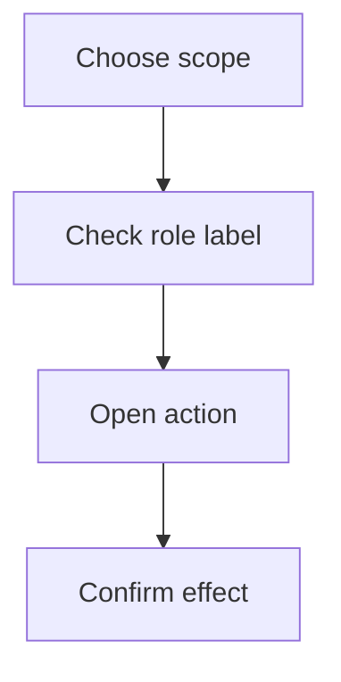

<CategoryHero category="accounts-and-access" icon="shield" eyebrow="Identity and permission" title="Multi-Role Access">
Understand registration, approval, sign-in security, player links, and why an action can be visible but unavailable.
</CategoryHero>

# Multi-Role Access

Multi-Role Access is the focused guide for leaders with more than one responsibility. It explains the controls you can see, the states that change what you can do, and the confirmation that proves the task finished in the intended scope.

## What this guide helps you decide

The main decision is whether to **use the least privileged role that completes the task**. Start by reading the scope label and the record status. A control can be present but unavailable when your membership, role, plan access, current status, or selected community does not permit the change. That distinction is intentional: visibility helps you understand the workflow, while availability protects shared records.

Use this page when you need to compare membership, role, grant, and selected scope. It is not a promise that every account sees every action. Public pages, signed-in features, role-restricted controls, subscription-backed capabilities, and intentionally private administration are documented as different availability classes.

## Before you begin

- Confirm the signed-in identity and the player link shown in the account area.
- Read the current kingdom, alliance, or personal scope before changing data.
- Open the record itself instead of relying on a notification or an old browser tab.
- Check whether the status is Visible, Read-only, Editable, or Unavailable.
- If the action affects other people, agree on the intended outcome before saving or publishing.

## Controls and information you will use

The relevant controls are: **Compare membership, role, grant, and selected scope**. Labels may be shortened on a narrow screen, but the scope name, status, primary action, and confirmation remain part of the same task. Filters change the current view; they do not silently move or rewrite the underlying record. A save changes a draft or editable record. Apply, approve, publish, restore, or award are separate decisions when the workflow requires review.

<VisualReference title="Recognizing the Multi-Role Access workspace" :items="['scope and identity context', 'current status and availability', 'primary action with confirmation']">
Look first for the category icon and accounts-and-access label, then read the scope line above the working area. The center region presents compare membership, role, grant, and selected scope. A status treatment identifies visible, read-only, editable, unavailable, while the final confirmation names the record and community affected.
</VisualReference>

## Complete the task

1. **Choose scope.** Confirm the page title, signed-in identity, and selected scope before entering or changing anything.
2. **Check role label.** Read existing values and status messages. If information is missing, stop and gather it rather than guessing.
3. **Open action.** Use the available control and review the preview, comparison, or warning. A disabled control usually points to a missing prerequisite.
4. **Confirm effect.** Read the success message and reopen the affected record. For shared work, verify that the next responsible role can see the expected state.

## Multi-Role Access workflow

The multi-role access map follows the choices visible to leaders with more than one responsibility and marks the confirmation that prevents work from continuing in the wrong state or scope.

<!-- diagram: ke-accounts-and-access-multi-role-access -->

**Diagram summary:** Choose scope, then Check role label, then Open action, then Confirm effect. Each step remains visible to the person doing the work, and the final step confirms the outcome.

*Workflow caption: Multi-Role Access from first choice to confirmed outcome.*

## Status and role differences

| Status | What it means to the reader | Sensible next action |
| --- | --- | --- |
| **Visible** | The task is at its starting or neutral state. | Continue with choose scope. |
| **Read-only** | Work has progressed but another check or decision remains. | Continue with check role label. |
| **Editable** | Work has progressed but another check or decision remains. | Continue with open action. |
| **Unavailable** | The workflow reached a final or constrained state. | Verify the outcome and history. |

For multi-role access, leaders with more than one responsibility see the records and outcomes their current responsibility permits. Alliance roles act within their alliance, while granted kingdom roles can coordinate across communities without silently taking ownership of every source record. Plan access can reveal accounts and access capabilities, but it never replaces the role, status, and scope checks described above. Platform-wide administration remains outside this public handbook.

## Saving, review, and history

While working in multi-role access, editable values should show a saved state before you leave. Review keeps check role label separate from the later decision to open action. Applying or publishing makes the agreed outcome visible to its intended audience. If removal, rollback, or restore is supported here, authorized readers retain enough history to understand the change. Reopen the source record before repeating confirm effect.

## If the result is not what you expected

- **The multi-role access action is missing:** confirm the selected scope, membership, role, and feature availability.
- **The action is disabled:** inspect required fields and the current status; a locked or final record may need a correction or review path.
- **The list looks unchanged:** clear view filters and reopen the source record before submitting again.
- **Another person sees a different result:** compare scope, date window, role, and publication state.
- **You need support:** record the page title, scope name, visible status, time, and safe steps to reproduce. Do not include passwords, payment details, or private screenshots.

## Continue learning

- [Accounts and Access](/kingshot-events/accounts-and-access/)
- [Registration and Approval](/kingshot-events/accounts-and-access/registration-and-approval)
- [Password and Sign-In Security](/kingshot-events/accounts-and-access/password-and-security)
- [Player Link Review](/kingshot-events/accounts-and-access/player-link-review)
