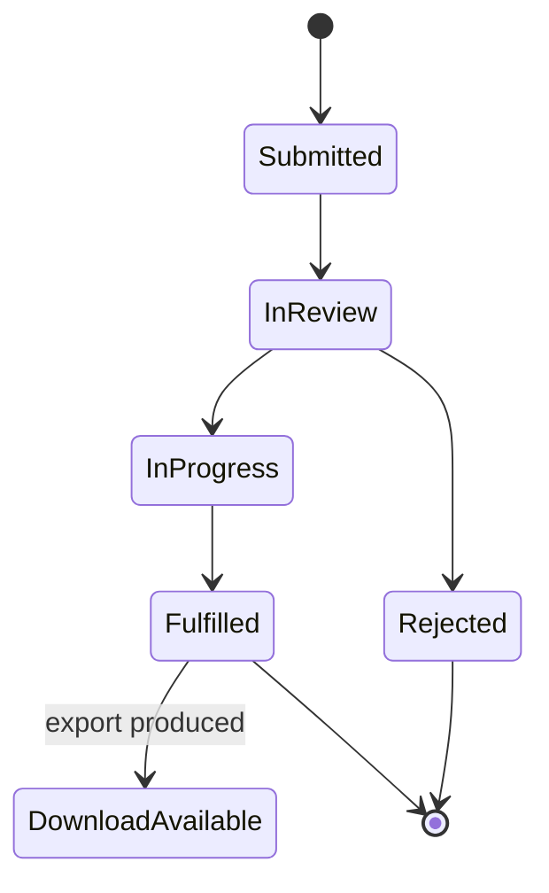

# Privacy and Data Control Center

The Privacy & Data Control Center combines consent controls, formal data-rights requests, request tracking, and available export downloads. It is account-specific; alliance or kingdom management authority does not grant access to another person's request history.

## Choose the correct action

| Need | Action |
| --- | --- |
| Change optional consent choices | Open privacy choices |
| Understand available rights | Open the data-rights explanation |
| Request access, correction, deletion, restriction, objection, or portability | Submit the matching formal request type |
| Check progress | Read the active and historical requests log |
| Download an available export | Use the download control on the fulfilled request |

Provide the email or identity information requested by the form and a precise description. Do not create repeated requests because a status is still pending or in review.

**Accessible summary:** A formal request is submitted, reviewed, processed, and fulfilled or rejected. An export download exists only when the fulfilled request provides one.

## Reviewer boundary and recovery

Authorized privacy reviewers can update the request through its governed status workflow. A status label such as pending, in review, in progress, fulfilled, complete, rejected, or denied describes the request, not the underlying account's general access.

**Example:** An account holder requests portability. They track the same request until it is fulfilled, then download the generated export from its record. They do not file a deletion request as a way to refresh the export.

If submission fails, preserve the selected request type and safe error text, then retry once after refreshing. If history is absent, confirm the signed-in identity. For legal interpretation, use the current privacy and data-rights pages; this guide explains product operation, not legal advice.

## Limits and troubleshooting

The control center cannot guarantee a particular legal outcome or response time. Changing optional consent does not automatically submit a formal deletion, access, or portability request. A fulfilled request without an export can be valid when the request type produces no downloadable file. If a download is unavailable, verify request type and status, then contact the privacy channel shown by the product. Never forward an export link or downloaded archive to another account.

## Readable review and accurate completion notices

The request-processing dialog uses readable light and dark theme colours, labelled controls, and keyboard dismissal when it is not saving. Review the response note before saving because it is visible to the requester.

After a request is fulfilled, it should no longer be counted as a pending privacy action. A new informational response can still appear for the requester until it is read. A notification never replaces checking the request's status or the availability of an export.
