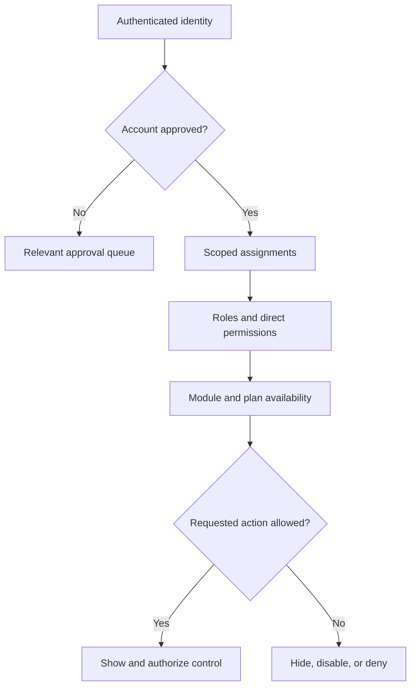

# Roles, Permissions, and Approval Queues

Access is resolved from identity, account state, scoped assignments, roles and permissions, module availability, and any applicable plan or grant. A role label is not sufficient evidence that a particular control should appear.

## Administration surfaces

- **Roles** defines named permission bundles; role detail shows the bundle being edited.
- **Permissions** provides the permission catalog and assignment view available to administrators.
- **User assignments** connects a user to the permitted kingdom, alliance, or operational responsibility.
- **Registration requests** reviews accounts awaiting approval, manages registration policy, and provides 1-click provisioning for suggested kingdoms and alliances.
- **Player-link reviews** accepts or rejects requested account-to-player identity links.
- **Password requests** tracks supported recovery or reset requests.

**Accessible summary:** Approval, scope, permissions, and availability are all checked before a control is authorized.

## Registration queue, filter tabs, and 1-click provisioning

The Registration Requests console provides tools to manage incoming applicants:
- **Filter tabs with live counters:**
  - **All Requests:** Complete list of applicants.
  - **Player Requests (No Elevation):** Dedicated view for approving ordinary player accounts without elevated role permissions.
  - **Uncreated Entities (Suggestions):** Isolates requests where the kingdom or alliance does not yet exist.
- **Search and server pagination:** Fast search across player names, email addresses, server codes, and alliance tags, with configurable page sizes.
- **Suggestion badges:** Uncreated kingdoms and alliances are marked with prominent visual badges (such as `🆕 New #999` and `🆕 New [TAG]`).
- **1-Click Accept & Provision:** Reviewers can click **Accept & Provision** on any suggestion. In a single atomic action, the platform creates the suggested kingdom and alliance, transitions the user from the holding realm into the newly created scope, and approves the account.
- **In-Game ID verification:** Displays the player's In-Game ID on the request card for cross-checking against game rosters.
- **Accelerated review contact message:** Registration Settings allows administrators to publish contact instructions (such as a Discord server link or Telegram handle) displayed to applicants for accelerated review.

## Safe change procedure

1. Identify the exact user and target scope.
2. Determine the smallest permission or role needed for the task.
3. Apply the assignment and verify the resulting effective access.
4. Keep approval decisions and their reasons in the owning queue.
5. Remove obsolete assignments rather than layering contradictory roles.

**Example:** A new alliance reviewer has an approved account but cannot resolve imports. The administrator verifies the alliance assignment and adds only the review permission intended for that scope. They do not grant a kingdom-wide administrative role.

If access remains wrong, check account approval, player link where relevant, assignment scope, explicit permission, module availability, and effective plan in that order. Report the denied action and scope without publishing the permission matrix or protected user data.

## Limits and troubleshooting

A visible administration page does not guarantee authority for every action inside it. Cached navigation can briefly outlive a permission change, but the server still decides the request. Avoid using a broad role as a diagnostic shortcut. When access differs between two users, compare approval state, assignments, roles, direct permissions, module status, and plan at the same scope. Record only the minimum safe identifiers needed for an administrator to reproduce the denial.

## Follow requests through Notifications

Registration, role, and player-link decisions can appear in the permitted recipient's notification inbox. Reviewers see actions for the responsibilities they actually hold; applicants receive their own updates. A notification is not a grant of additional access.

Use **Review item** to open the appropriate request. Reading or marking it seen does not approve it. Once the required decision is complete, it should no longer keep that section's pending-action dot active. [Notifications and Reports](/kingshot-events/lifecycles/notifications-and-reports) explains the red dots and urgent view.
