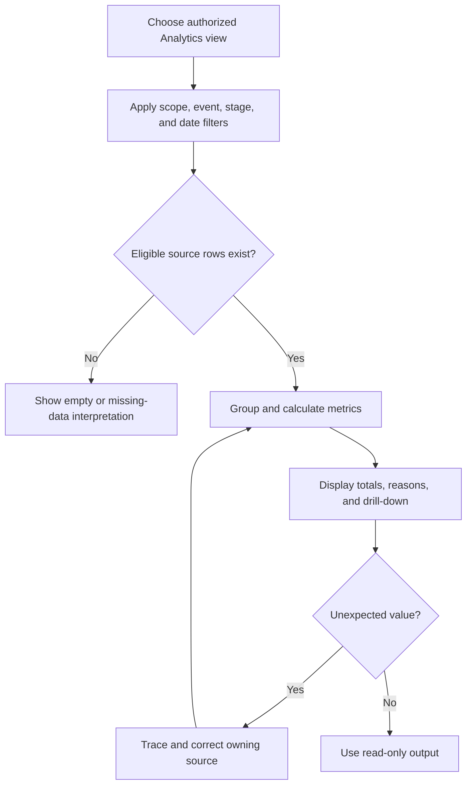

# War Room Analytics Overview

**War Room Analytics** turns saved player, event, participation, and score records into kingdom, alliance, player, and custom views. It does not create missing results or correct an import automatically. The selected tab, community scope, event filters, and subscription features determine what appears.

## Choose a tab

| Tab | Use it for | Availability |
| --- | --- | --- |
| **Kingdom** | Alliance standings, kingdom trends, event focus, and kingdom-wide leaders | Shown to users with kingdom analytics access. A shared grant may show **Granted Kingdom** instead. |
| **Alliance** | Member intelligence, participation, event summaries, score trends, and inactivity review | Requires an alliance the viewer may inspect. An alliance picker appears when more than one is available. |
| **Player** | One player's ranks, score history, attendance, event breakdown, and cross-event consistency | Labeled **Player (Premium)** and locked when Player Cross-Event Analytics is unavailable. |
| **Custom** | A table and chart built from an event, date range, metric, and grouping | Labeled **Custom (Premium)** and locked when Custom Analytics is unavailable. |

Opening a player from a kingdom or alliance table switches to the Player tab with that player selected. A locked tab remains visible so users can understand what the subscription feature would add, but it does not reveal the protected data.

## Scope comes before interpretation

Analytics always reads records inside an allowed context. An alliance assignment normally limits alliance analytics to that alliance. Kingdom managers can work across eligible alliances in their kingdom. A kingdom analytics grant can expose kingdom-level aggregates and permitted alliance summaries without granting edit access or membership in those alliances.

Confirm the tab and the alliance picker before comparing values. Switching scope can change the population, rankings, totals, and available drill-down actions. Analytics access is read-only unless the same user separately has permission to edit players, events, or results.

## Where the numbers come from

The platform recalculates player analytics after accepted or edited result data changes. Totals, averages, attendance, tracked-event counts, missed-event counts, statuses, and rankings can therefore change after an import is accepted, a manual result is corrected, or an eligible event setting changes. Recalculation is not a second copy of the original record: the result and event history remain the review source.

An empty chart can be correct when no eligible records exist for the selected scope or period. Events excluded from analytics, deleted players, records outside a date filter, and incomplete participation data do not contribute in the same way as ordinary saved results.

<VisualReference title="War Room Analytics landmarks">
Start at the tab row, then verify any alliance, event, or date controls before reading the charts.

<template #items>

- **Kingdom**, **Alliance**, **Player**, and **Custom** tabs, including premium labels or **Granted Kingdom**.
- Alliance picker and date or event-category filters where the selected tab supports them.
- KPI tiles, charts, leaderboards, expandable tables, and clickable player or alliance rows.
- Locked-feature notice and **Request Subscription** action when a premium tab is unavailable.

</template>
</VisualReference>

## Purpose and complete workflow

War Room Analytics solves the problem of interpreting many scoped result rows without losing their event, date, participation, score, player, and source meaning. Start by selecting Kingdom, Alliance, Player, or Custom view. Confirm effective read access and active scope, then choose event, stage where relevant, and inclusive date boundaries. Eligible current results pass those filters before grouping. Participation metrics count tracked Active, Inactive, and Unknown rows; score totals and averages use scored rows; derived activity, internal points, recommendations, and rewards use their configured rules.

The output is a summary with filters and drill-down, not a new source record. Kingdom groups permitted child-alliance information, Alliance remains within one alliance, Player compares one identity across eligible events, and Custom applies supported premium grouping. A shared or granted view remains read-only. Managers correct a surprising value at the player result, event batch, import, or configured rule, then reproduce the same view after recalculation.

*Analytics input-to-output and correction workflow. Filters and source eligibility precede summaries; corrections return to the owner.*

**Accessible summary:** The view filters eligible rows, groups them, displays drill-down, and sends surprising values back to the source before recalculation.

## Worked example, troubleshooting, and limitations

**Starting situation:** Player Analytics has participation rows but no average score. Drill-down shows that the selected occurrences recorded participation only. Missing scores are excluded, not treated as zero. The correct output is participation metrics with no score average. Adding invented zeros would change meaning. If scored evidence exists elsewhere, verify event, result type, date, stage, scope, and apply state. Analytics cannot reconstruct unapplied imports, bypass access, or guarantee that an absent row means inactivity.

## Limitations and troubleshooting boundary

Analytics cannot guarantee that a missing row represents non-participation, that a nickname identifies the intended player, or that a community collected every event. It reports accepted current evidence under named filters. Troubleshoot by preserving the view and tracing one surprising value through drill-down to its player result and batch. If the source is correct but the summary remains stale, record the recalculation time and filters for an authorized manager. Shared viewers must request correction from the owning scope and should never receive edit access merely to resolve one total.

## Continue with the view you need

- [Kingdom analytics](/kingshot-events/analytics/kingdom)
- [Alliance analytics](/kingshot-events/analytics/alliance)
- [Player analytics](/kingshot-events/analytics/player)
- [Custom analytics](/kingshot-events/analytics/custom)
- [Sharing, access, and missing data](/kingshot-events/analytics/sharing-and-troubleshooting)
- [Reward eligibility and statuses](/kingshot-events/analytics/rewards-and-statuses)
