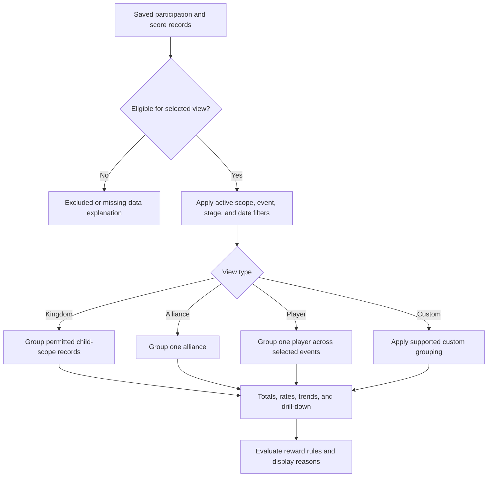

# Analytics and Rewards

<CategoryHero category="analytics" icon="chart" eyebrow="Summaries inherit the meaning of their source records" title="Analytics and Rewards">
Analytics groups eligible saved results. Rewards apply configured participation or score rules to eligible records. Neither view repairs missing or incorrectly scoped source data by itself.
</CategoryHero>

<ProductFinder default-category="Analytics and Rewards" />

## Input to decision to output

*Analytics and reward flow. Eligibility and filters precede grouping; reward decisions consume qualified records and expose a reason.*

**Accessible summary:** Saved records are checked for eligibility, filtered by scope and time context, grouped according to the selected view, then shown as summaries and possible reward decisions.

## Views and scope

**Kingdom Analytics** aggregates eligible information across the permitted kingdom context. **Alliance Analytics** stays within one alliance. **Player Analytics** follows one player across the selected eligible events and boundaries. **Custom Analytics** applies supported premium grouping and filters; it is not an unrestricted database query. Shared or granted Analytics can expose a read-only view. That grant does not authorize changing results or reward rules.

Date boundaries and event selection determine which occurrences participate. Grouping happens after those filters. Drill-down should reconcile the displayed total with its contributing records; if it does not, check whether a filter, cumulative stage, result kind, or activity interpretation differs. Recalculation uses the current eligible source data and current applicable rule configuration. It cannot recreate records that were never saved.

## Reward decisions

Reward rules can consider eligible participation records, score records, configured thresholds, event or stage context, and the precedence described by [Analytics Aggregation and Reward Decisions](/kingshot-events/analytics/reward-rules). Missing values do not automatically mean zero unless the relevant rule explicitly treats them that way. When rules conflict, the configured decision order determines the displayed outcome; a manual change remains distinct and should expose its reason or source context.

## Worked example: shared but read-only

**Starting situation:** Sam receives kingdom Analytics through an accepted grant. One alliance total looks too low. **Inputs:** Selected kingdom, date range, event filter, eligible result records. **Rules:** The grant permits viewing and drill-down but not editing source results. **Branch:** Sam finds one missing player result. **Output:** The dashboard remains read-only and explains the contributing records. **Reason:** Analytics access and result-management authority are separate. **Next action:** Sam sends the alliance, event, date, player, filters, and expected source to an authorized manager, who corrects the source batch and triggers normal recalculation.

## When a view is empty or surprising

Check, in order: active scope; effective Analytics access; selected view; event and stage; start and end boundaries; whether results were saved or merely reviewed; lock or correction state; player membership interpretation; and whether the view is awaiting recalculation. Do not create duplicate results to make a total appear. Correct the source event, record batch, or reward rule.

Read next: [Kingdom](/kingshot-events/analytics/kingdom), [Alliance](/kingshot-events/analytics/alliance), [Player](/kingshot-events/analytics/player), [Custom](/kingshot-events/analytics/custom), or [sharing and troubleshooting](/kingshot-events/analytics/sharing-and-troubleshooting).
