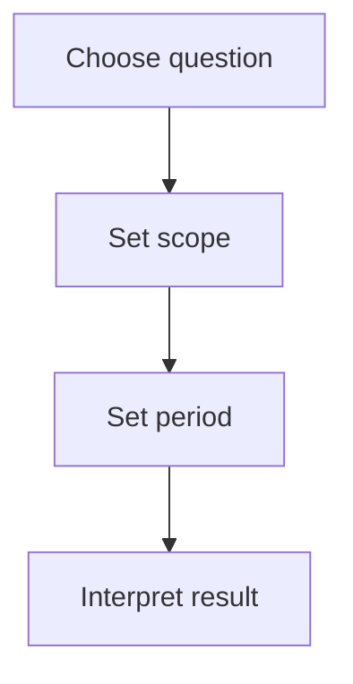

<CategoryHero category="analytics" icon="chart" eyebrow="Evidence for decisions" title="Analytics and Rewards Guide">
Read scope-aware trends, find missing data, and turn agreed reward rules into explainable outcomes.
</CategoryHero>

# Analytics and Rewards Guide

Read scope-aware trends, find missing data, and turn agreed reward rules into explainable outcomes. This guide is the decision point for players, leaders, and reward managers: it explains where to begin, what changes with scope or role, and which focused guide answers the next question.

## What this guide helps you decide

The main decision is whether to **use a view whose inputs and scope match the question**. Start by reading the scope label and the record status. A control can be present but unavailable when your membership, role, plan access, current status, or selected community does not permit the change. That distinction is intentional: visibility helps you understand the workflow, while availability protects shared records.

Use this page when you need to choose scope, measure, time window, and decision view. It is not a promise that every account sees every action. Public pages, signed-in features, role-restricted controls, subscription-backed capabilities, and intentionally private administration are documented as different availability classes.

## Before you begin

- Confirm the signed-in identity and the player link shown in the account area.
- Read the current kingdom, alliance, or personal scope before changing data.
- Open the record itself instead of relying on a notification or an old browser tab.
- Check whether the status is Current, Incomplete, or Recalculated.
- If the action affects other people, agree on the intended outcome before saving or publishing.

## Controls and information you will use

The relevant controls are: **Choose scope, measure, time window, and decision view**. Labels may be shortened on a narrow screen, but the scope name, status, primary action, and confirmation remain part of the same task. Filters change the current view; they do not silently move or rewrite the underlying record. A save changes a draft or editable record. Apply, approve, publish, restore, or award are separate decisions when the workflow requires review.

<VisualReference title="Recognizing the Analytics and Rewards Guide workspace" :items="['scope and identity context', 'current status and availability', 'primary action with confirmation']">
Look first for the category icon and analytics label, then read the scope line above the working area. The center region presents choose scope, measure, time window, and decision view. A status treatment identifies current, incomplete, recalculated, while the final confirmation names the record and community affected.
</VisualReference>

## Complete the task

1. **Choose question.** Confirm the page title, signed-in identity, and selected scope before entering or changing anything.
2. **Set scope.** Read existing values and status messages. If information is missing, stop and gather it rather than guessing.
3. **Set period.** Use the available control and review the preview, comparison, or warning. A disabled control usually points to a missing prerequisite.
4. **Interpret result.** Read the success message and reopen the affected record. For shared work, verify that the next responsible role can see the expected state.

## Analytics and Rewards Guide workflow

The analytics and rewards guide map follows the choices visible to players, leaders, and reward managers and marks the confirmation that prevents work from continuing in the wrong state or scope.

<!-- diagram: ke-analytics-and-rewards-index -->

**Diagram summary:** Choose question, then Set scope, then Set period, then Interpret result. Each step remains visible to the person doing the work, and the final step confirms the outcome.

*Workflow caption: Analytics and Rewards Guide from first choice to confirmed outcome.*

## Status and role differences

| Status | What it means to the reader | Sensible next action |
| --- | --- | --- |
| **Current** | The task is at its starting or neutral state. | Continue with choose question. |
| **Incomplete** | Work has progressed but another check or decision remains. | Continue with set scope. |
| **Recalculated** | The workflow reached a final or constrained state. | Verify the outcome and history. |

For analytics and rewards guide, players, leaders, and reward managers see the records and outcomes their current responsibility permits. Alliance roles act within their alliance, while granted kingdom roles can coordinate across communities without silently taking ownership of every source record. Plan access can reveal analytics and rewards capabilities, but it never replaces the role, status, and scope checks described above. Platform-wide administration remains outside this public handbook.

## Saving, review, and history

While working in analytics and rewards guide, editable values should show a saved state before you leave. Review keeps set scope separate from the later decision to set period. Applying or publishing makes the agreed outcome visible to its intended audience. If removal, rollback, or restore is supported here, authorized readers retain enough history to understand the change. Reopen the source record before repeating interpret result.

## If the result is not what you expected

- **The analytics and rewards guide action is missing:** confirm the selected scope, membership, role, and feature availability.
- **The action is disabled:** inspect required fields and the current status; a locked or final record may need a correction or review path.
- **The list looks unchanged:** clear view filters and reopen the source record before submitting again.
- **Another person sees a different result:** compare scope, date window, role, and publication state.
- **You need support:** record the page title, scope name, visible status, time, and safe steps to reproduce. Do not include passwords, payment details, or private screenshots.

## Continue learning

- [Filters and Recalculation](/kingshot-events/analytics/filters-and-recalculation)
- [Recommendations and Missing Data](/kingshot-events/analytics/recommendations-and-missing-data)
- [Reward Rules and Outcomes](/kingshot-events/analytics/reward-rules)
