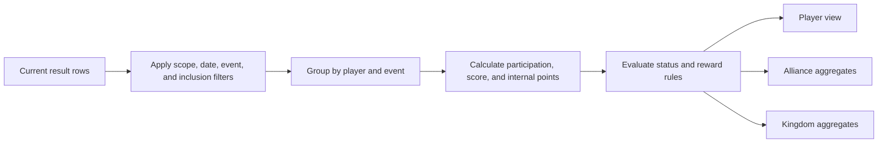

# Analytics Aggregation and Reward Decisions

Analytics reads current, non-deleted player results whose events are also current. Filters are applied to eligible source rows before grouping. A player view groups by player and event; alliance and kingdom views group only rows inside the authorized scope. Date boundaries and event filters can therefore make two valid totals differ.

For each event, participation rate is Active rows divided by all tracked rows. Score totals, averages, best score, and latest score use only rows containing scores. Internal points add the event's configured Active, Inactive, or Unknown points plus the first score band, ordered by rule priority and then minimum score, whose bounds include the score. Recalculation replaces the derived player-event and player summary rather than stacking another summary.

## Filter evaluation and sharing

Start with resolved access, then scope, event, date range, participation or attribute filters, and finally grouping or sorting. A kingdom role can read kingdom-wide aggregates. Alliance leaders read their own alliance. Granted kingdom analytics can expose aggregate kingdom context to an accepted alliance when the kingdom enables it and the plan carries the eligible feature. Cross-alliance comparison requires both alliances to hold suitable accepted grants. It remains read-only and never grants roster or result editing.

Missing rows are not zeros. An Unknown participation row is tracked but not Active. A missing score is excluded from score averages. An absent player/event row means no accepted evidence was available for that identity and filter set. Recommendations may flag an alliance when participation is below 60% or inactive members reach at least three or 20% of membership, but that signal is a review prompt, not a disciplinary decision.

## Reward rule evaluation

Reward rules are selected by their configured scope and enabled state. Each rule compares its declared boundaries with calculated metrics such as internal points, participation rate, tracked events, missed events, average score, and total score. Every boundary present on one rule must pass; a boundary not configured does not fail the rule. Multiple matching rules can produce multiple eligibility records. The displayed reason should come from the matching rule and its metrics, not from a hidden score.

A manual handled state records a later human action without rewriting why the calculated rule matched. Corrections or accepted imports recalculate affected players. Deleted source rows stop contributing after recalculation.

**Worked aggregation:** Arin has three tracked rows in the selected period: Active with 100 points, Active with no score, and Inactive with 40 points. Participation is 67% after rounding; score total and average are both 140 because only two rows have scores. Internal points add the configured participation points and applicable score-band points for all three rows.

**Worked missing-data case:** Bea appears to have zero event score in one chart but no row in drill-down. This is not evidence of a zero score. Remove event and date filters, check whether the batch was accepted, and inspect Unknown or missing rows before interpreting the comparison.

## Limits

Configurable thresholds are intentionally not hard-coded in this handbook. A recommendation or eligibility result is only as current as its accepted rows and last recalculation. Shared analytics does not change ownership of source data.
