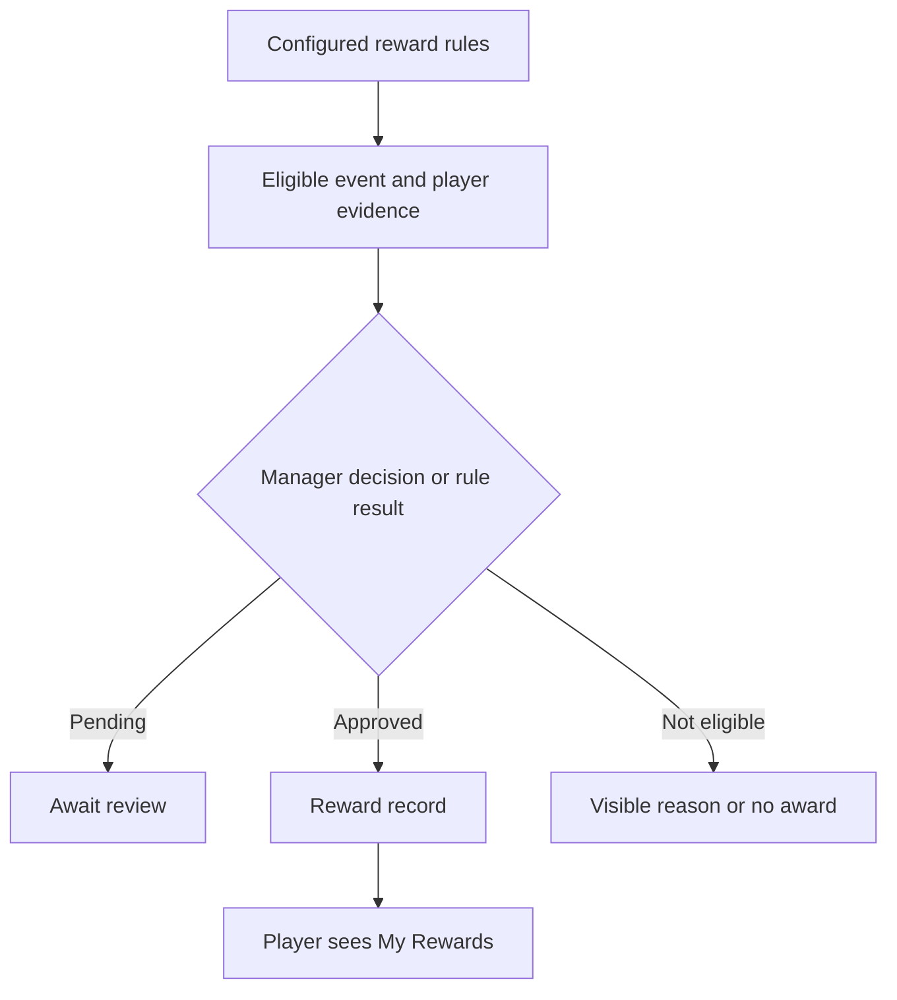

# Reward Workspace and Personal Rewards

The reward workspace is the manager-facing place for reward records and decisions. **My Rewards** is the player-facing view of outcomes visible to the signed-in identity. Analytics can inform a reward decision, but it is not itself an award.

## Separate configuration, decision, and viewing

Reward settings define the available rule or status vocabulary. Managers apply the permitted workflow to scoped players and events. Players then see their own visible reward records. A missing personal result can therefore mean no eligible award, a pending decision, a different linked player identity, a different scope, or an access problem.

**Accessible summary:** Configured rules and scoped evidence produce a decision; an approved record becomes visible to the linked player.

## Manager checklist

- Confirm kingdom, alliance, event, date range, and player identity.
- Resolve missing or duplicate source results before deciding.
- Read the rule order and tie handling in [Analytics Aggregation and Reward Decisions](/kingshot-events/analytics/reward-rules).
- Keep pending, approved, rejected, issued, or other exposed states distinct.
- Verify the saved reward record and its reason instead of relying on a dashboard count.

## Worked example and recovery

Two players have similar totals, but one has an unresolved result row. The manager does not treat the unresolved row as zero and finalize the comparison. They correct the input, recalculate, then record the decision. The player opens **My Rewards** under the linked account to verify the outcome.

If a player sees the wrong or no outcome, first confirm the account-to-player link and active scope. If a manager sees a stale result, refresh the analytics source and inspect the reward's current state. Never create a second reward merely to compensate for a visibility problem.

## Limits and troubleshooting

The workspace does not guarantee that an external prize was delivered, and analytics rank alone does not grant a reward. A player may see fewer fields than a manager because the personal view is intentionally narrower. When a decision is disputed, preserve the rule version, event and date range, source-result status, player identity, decision state, and visible reason. Recalculate only after correcting source evidence; changing filters until a preferred player wins is not a valid recovery path.
