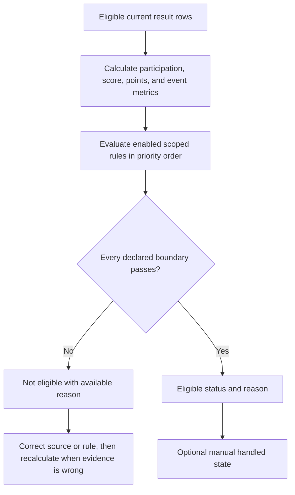

# Reward Eligibility and Statuses

Reward views evaluate saved event data against the current scoped reward rules. **My Rewards** shows the linked player's result when available; authorized managers can review broader eligibility lists and configure supported rules.

## What can affect eligibility

Rules can use the selected event, date or period, participation, score, player status, attributes, scope, and configured thresholds. The visible outcome can be **eligible**, **not eligible**, **needs review**, or another configured state. It is a platform decision aid, not a promise that an external in-game reward was delivered.

## Review before awarding

1. Confirm the alliance or kingdom and reward period.
2. Open the rule summary and contributing event instances.
3. Check missing, unknown, corrected, or excluded results.
4. Review the player's current primary status and any manual override.
5. Correct the source event result or rule, then reload after recalculation.

Do not manually change a player status solely to force a reward outcome without recording the real reason. A corrected same-date result can change eligibility after Analytics recalculates.

<VisualReference title="Reward eligibility landmarks">
Read the rule and source records beside the outcome.

<template #items>

- Active reward scope, period, and event or rule selector.
- Player, linked-profile, status, attribute, participation, and score context.
- Eligible, not eligible, or needs-review result with contributing conditions.
- Manager rule or review action and visible refresh after source correction.

</template>
</VisualReference>

Related: [Reviewing Results and Event History](/kingshot-events/events/review-and-history) and [Player Lifecycle](/kingshot-events/players/lifecycle).

## Decision workflow

Reward evaluation starts from current eligible results in the applicable player, alliance, event, and date context. Participation and score rules use only metrics and boundaries they declare. Missing evidence does not automatically become zero. When several enabled scoped rules match, configured priority and visible matching reasons determine output. A later manual handled state records human follow-up without rewriting why calculation matched.

*Reward eligibility decision. Declared boundaries determine eligibility, while human handling remains a later state.*

**Accessible summary:** Eligible rows form metrics, prioritized rules test their boundaries, matches create eligibility, and manual handling follows without changing the reason.

**Worked example:** A player has enough score but too few tracked events for a rule declaring both boundaries. Score passes and event count fails, so the player is not eligible. A duplicate score would not fix the failing condition. Correct a missing applied event row or have an authorized reward manager change the visible scoped rule. Preserve rule, priority, metrics, filters, source events, reason, and recalculation time. Reward output cannot guarantee an unrecorded activity occurred.
