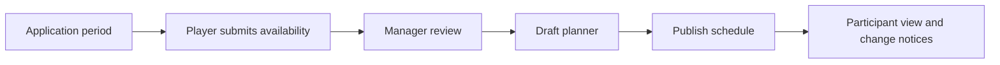

<CategoryHero category="castle-positions" icon="crown" eyebrow="A fair, visible appointment cycle" title="Castle Positions Overview">
Coordinate eligibility, applications, review, scheduling, publication, and later changes without losing the status of each applicant.
</CategoryHero>

<ProductFinder default-category="Castle Positions" />

# Castle Positions Overview

Castle Positions coordinates player applications and a kingdom schedule. Players submit identity, stage availability, time choices, resources, and configured answers. Authorized kingdom managers review candidates, build a draft schedule, and publish the result participants can rely on.

An accepted application is not a guaranteed assignment. A requested time is not confirmed until the published schedule contains the player. Suggestions do not appoint players automatically.

## Start by perspective

- Players: [apply and update an application](/kingshot-events/castle-positions/applicant-guide).
- Kings, kingdom managers, and Ministers of Justice: [review candidates](/kingshot-events/castle-positions/review-workflow), then [plan and publish](/kingshot-events/castle-positions/planning-and-publishing).
- Everyone: [understand statuses and changes](/kingshot-events/castle-positions/statuses-and-changes).

## Core hierarchy

One kingdom instance contains stages. A stage represents a dated scheduling segment and contains supported castle positions and time slots. Applications record a player's choices for those stages. The planner places a candidate into one compatible slot and position, subject to the current stage configuration, conflicts, and locks.

<VisualReference title="Castle Positions lifecycle landmarks">
The public application and manager planner show different parts of the same kingdom instance.

<template #items>

- Application-period state, kingdom identity, stage cards, availability and requested time.
- Candidate review pools with player identity, resources, preferences, conflicts, and review status.
- Planner stage selector, position columns, time rows, player cards, suggestions, and locks.
- Draft save, publish state, participant schedule, and changed-assignment notices.

</template>
</VisualReference>

Castle Positions is separate from event score tracking and KvK Prep. It may use player records and kingdom context, but publishing a schedule does not create an event result.

## How the mechanisms relate

Application configuration establishes the active kingdom cycle, stages, positions, time slots, questions, and permitted resource choices. A player submits one application with identity, preferred time, availability, relevant resources, position choices, and required answers. An unlinked or uncertain identity can move the application to Needs Review; it must not be silently attached to a similar nickname.

Review separates eligibility from scheduling preference. An eligible candidate can still have no compatible time, lose a conflict, encounter a full row, or remain standby. The planner combines open grid capacity, compatible candidates, resource relevance, locks, current placements, and public-safe suggestion order. A manager decides whether to accept a suggestion or place manually. Whole-draft validation precedes publication.

## Important states and common mistakes

Applications can be draft, submitted, needs review, eligible, rejected, scheduled, standby, or otherwise closed by the cycle. Schedules remain draft until publish validation succeeds. A published version is participant-facing and identifiable; a later change creates a controlled new version and notices rather than silently editing history.

Common mistakes are treating submission as appointment, changing an applicant's declared time to fill a row, assuming an unlinked name is the intended player, unlocking a deliberate placement before generating suggestions, or reading an old notice instead of the latest published version. Recover in the owning application or draft, not by creating a second cycle.

## Worked example

**Starting situation:** Ana applies for a position, is eligible, and prefers the final time slot. That row is already full and all other times are incompatible. **Rules:** Eligibility does not override capacity or declared time compatibility. **Branch:** Ana remains standby. **Output:** The planner shows the gap between eligibility and placement; the published schedule does not include her. **Next action:** If a compatible place opens, a manager starts a controlled change, rechecks locks and conflicts, validates the draft, and publishes the next version.

## Recommended reading order

Read [Applicant Guide](/kingshot-events/castle-positions/applicant-guide), [Resources and Eligibility](/kingshot-events/castle-positions/resources-and-eligibility), [Review Workflow](/kingshot-events/castle-positions/review-workflow), [Candidate Ranking and Suggestions](/kingshot-events/castle-positions/planner-controls), [Planning and Publishing](/kingshot-events/castle-positions/planning-and-publishing), then [Statuses and Changes](/kingshot-events/castle-positions/statuses-and-changes). Use [Castle Position Problems](/kingshot-events/troubleshooting/castle-position-problems) for recovery.

The system cannot see offline agreements, unsubmitted availability, or missing resource information. Human review remains responsible for exceptional context and fair communication.
