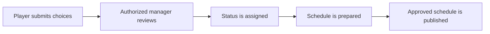

# Castle Positions Overview
Castle Positions connects public application entry points, personal appointment views, authorized review, planning, and schedule publication. Availability depends on an active configured workflow and the viewer's access.

An application is not a guaranteed appointment. Published schedules are the community-facing outcome.
<VisualReference title="Castle Positions Overview orientation">
Use the current page labels and confirm context before acting.

<template #items>

- Active scope or profile.
- Primary input and review area.
- Visible save, submit, result, or status feedback.

</template>
</VisualReference>

## Related guides

- [applicant guide](/kingshot-events/castle-positions/applicant-guide)
- [statuses and changes](/kingshot-events/castle-positions/statuses-and-changes)
