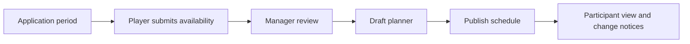

# Castle Positions Overview

Castle Positions coordinates player applications and a kingdom schedule. Players submit identity, stage availability, time choices, resources, and configured answers. Authorized kingdom managers review candidates, build a draft schedule, and publish the result participants can rely on.

An accepted application is not a guaranteed assignment. A requested time is not confirmed until the published schedule contains the player. Suggestions do not appoint players automatically.

## Start by perspective

- Players: [apply and update an application](/kingshot-events/castle-positions/applicant-guide).
- Kings, kingdom managers, and Ministers of Justice: [review candidates](/kingshot-events/castle-positions/review-workflow), then [plan and publish](/kingshot-events/castle-positions/planning-and-publishing).
- Everyone: [understand statuses and changes](/kingshot-events/castle-positions/statuses-and-changes).

## Core hierarchy

One kingdom instance contains stages. A stage represents a dated scheduling segment and contains supported castle positions and time slots. Applications record a player's choices for those stages. The planner places a candidate into one compatible slot and position, subject to the current stage configuration, conflicts, and locks.

<VisualReference title="Castle Positions lifecycle landmarks">
The public application and manager planner show different parts of the same kingdom instance.

<template #items>

- Application-period state, kingdom identity, stage cards, availability and requested time.
- Candidate review pools with player identity, resources, preferences, conflicts, and review status.
- Planner stage selector, position columns, time rows, player cards, suggestions, and locks.
- Draft save, publish state, participant schedule, and changed-assignment notices.

</template>
</VisualReference>

Castle Positions is separate from event score tracking and KvK Prep. It may use player records and kingdom context, but publishing a schedule does not create an event result.
