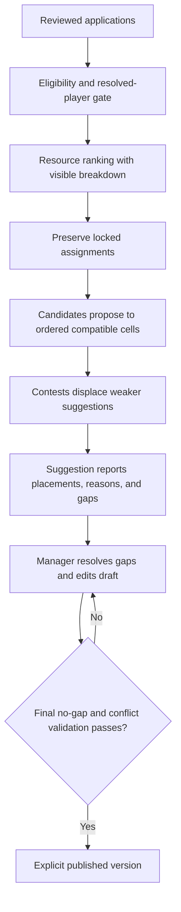
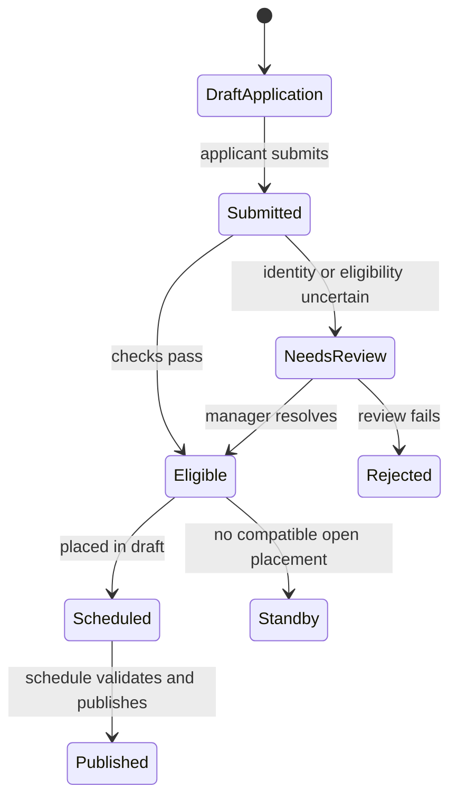
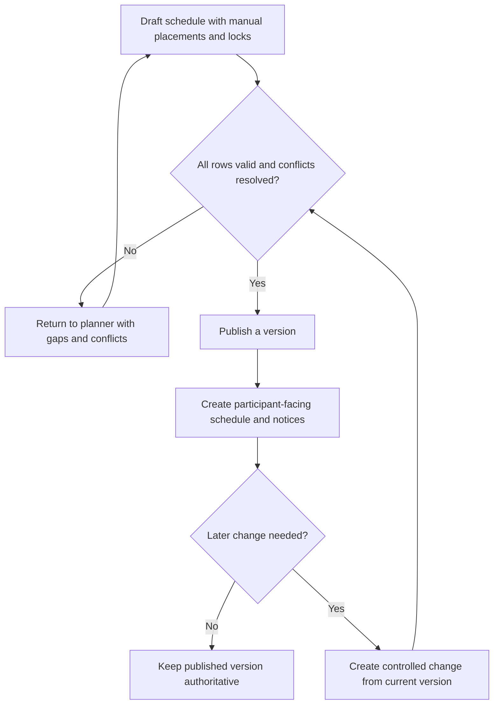

# Castle Candidate Ranking and Schedule Suggestions

The planner separates **eligibility**, **ranking**, and **placement**. A high score never makes an ineligible application eligible. An unresolved player cannot be placed. Suggestions never publish themselves.

## Ranking

For one stage, only configured resources with ranking enabled contribute. Duration resources contribute `weight x effective total days`. True Gold contributes `weight x amount`. General Speedups are not scored as a separate pool because allocated portions are already included in their target categories. Missing optional resources contribute zero. With no stage rules, declared effective days are summed without weights.

Eligible applications rank by score descending, then True Gold amount, earliest preferred time, player name, and application identity. This stable order makes repeated previews deterministic.

## Placement order

1. Classify applications by eligibility, resolved player, and placeable status: Accepted, Linked, Scheduled, or Changed. Ineligible and unresolved applications remain visible as unplaced with a reason instead of disappearing silently.
2. Seed protected assignments first. Explicit locks, manager-placed players, and reserved notes are immovable and keep their occupied time.
3. Build each candidate's ordered list of compatible cells. Exact preferences come first, then alternatives, nearby times ordered by distance, and finally Any Time; **Highest Score** deliberately uses chronological compatible cells instead.
4. Process stronger candidates and let each propose to its next compatible cell. A free cell accepts the proposal. A contested cell keeps the stronger claim and sends the displaced candidate to its next option. A candidate cannot hold overlapping appointments.
5. For **Balanced**, recommendation score wins a contested cell first; compatibility breaks a score tie, followed by scarcity, submission time, and stable application identity. **Highest Score** also makes score primary but drops preference ordering from the candidate's proposal list. **Best Time Match** makes compatibility primary, then score, scarcity, submission time, and identity.
6. Stop only when every placeable candidate is assigned, exhausts compatible cells, or is blocked by stronger or protected assignments. Each candidate/cell pair is tried at most once, so the deterministic proposal loop terminates.
7. Report exact, alternative, nearby, and Any Time placements; displacements; protected assignments; unplaced reasons; and gaps. The suggestion engine may leave an early empty cell to honor declared preferences. It does not pull a candidate into an unwanted early time merely to hide the gap.
8. Require a manager to resolve reported gaps and review the draft. Finalization enforces the no-gap invariant; a draft with an empty cell before an occupied cell cannot finalize. Publishing then creates an explicit version and notifies affected participants according to configured delivery.

**Accessible summary:** Reviewed applications are ranked, protected placements are preserved, candidates compete for compatible cells, gaps return to editing, and only a validated draft can publish.

**Example 1:** Ava requests 10:00 exactly and has score 80. Bo accepts Any Time with score 95. In **Balanced**, Bo wins a direct contest for 10:00 because score is primary; compatibility breaks only a score tie. In **Best Time Match**, Ava wins because Exact outranks Any before score. In **Highest Score**, Bo proposes chronologically and remains the stronger claim. A protected assignment at 10:00 prevents either applicant from taking that cell.

**Example 2:** Cia requests only 12:00, while the 10:00 row has no compatible candidate. The suggestion can place Cia at 12:00 and report the earlier gap instead of silently dragging her to 10:00. The manager must fill, reserve, or otherwise resolve the earlier cell before finalization, because final validation rejects a middle gap.

## Failure and change paths

Suggestion calculation can become stale or fail while the previous projection remains visible with an error state. Retry before trusting it. Duplicate players in one stage, duplicate grid cells, overlaps, and no-gap violations block save or finalization. Reopening a published schedule does not erase the previous public version; edits occur in a draft successor. Publication then records the new version and affected-applicant differences.

## Limitations

The ranking is a scheduling aid, not proof of the fairest political decision or a guaranteed globally optimal schedule. It can compare only submitted preferences, resolved identities, configured resources, and the current grid. Offline agreements and missing availability are invisible until a manager records them. Preserve locks and review every reported gap before publication.

## Application and publication lifecycles

### Castle application lifecycle

*Castle application lifecycle. Review, eligibility, scheduling, standby, and publication are distinct states.*

**Accessible summary:** Submitted applications can require review, become eligible or rejected, then move to a draft placement or standby before an eligible placement is published.

### Draft schedule, publication, and later changes

*Draft-to-publish and change flow. Later changes pass validation and produce a controlled version instead of mutating published history silently.*

**Accessible summary:** Invalid drafts return to planning, valid drafts publish with notices, and later changes re-enter validation before a new authoritative version.

## Scope-aware planner workflow

The planner always belongs to one kingdom cycle. Start by confirming that kingdom and cycle, then load submitted applications and resolve linked-player or eligibility review. Candidate generation removes wrong-position, incompatible-time, ineligible, conflicting, and already-placed options before ranking the remainder. Managers compare the suggestion with resource relevance and declared preferences, preserve manual locks, place or hold standby candidates, and inspect gaps and full rows. Publish validation checks the whole draft, not merely the last edited row. The output is an identifiable kingdom schedule version plus participant notices. Alliance membership can inform candidate context, but switching alliance does not move the kingdom planner or its draft.
