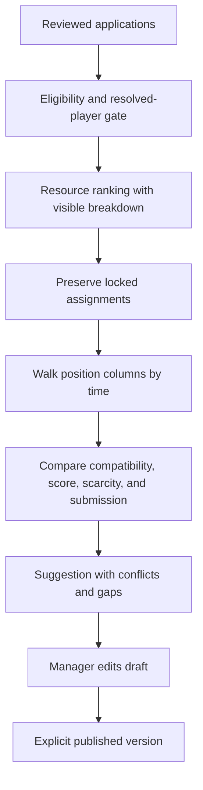
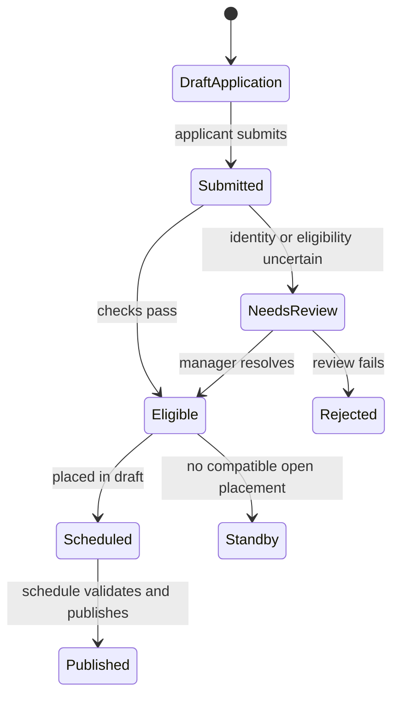
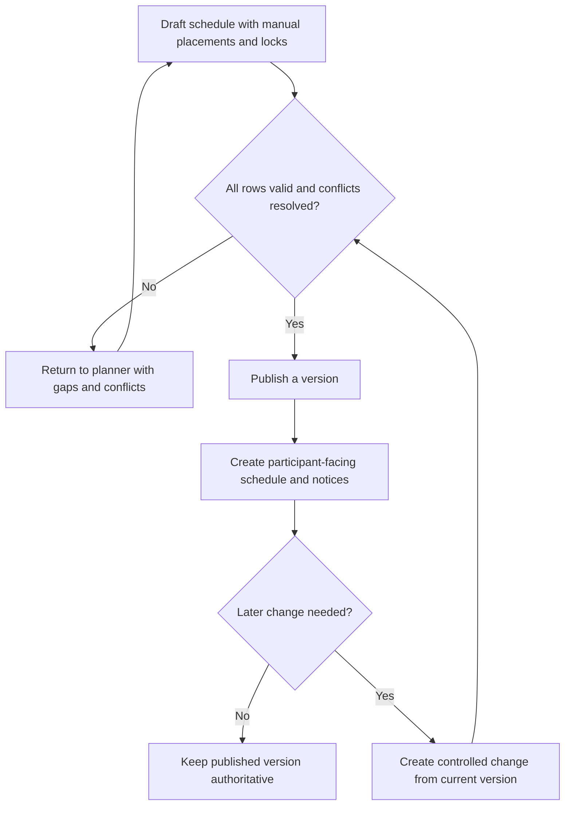

# Castle Candidate Ranking and Schedule Suggestions

The planner separates **eligibility**, **ranking**, and **placement**. A high score never makes an ineligible application eligible. An unresolved player cannot be placed. Suggestions never publish themselves.

## Ranking

For one stage, only configured resources with ranking enabled contribute. Duration resources contribute `weight x effective total days`. True Gold contributes `weight x amount`. General Speedups are not scored as a separate pool because allocated portions are already included in their target categories. Missing optional resources contribute zero. With no stage rules, declared effective days are summed without weights.

Eligible applications rank by score descending, then True Gold amount, earliest preferred time, player name, and application identity. This stable order makes repeated previews deterministic.

## Placement order

1. Remove applications that are ineligible, unresolved, or not in Accepted, Linked, Scheduled, or Changed state.
2. Preserve every locked manual assignment and its occupied time.
3. Walk each position column from its first time row downward so occupied cells form a contiguous prefix.
4. For a cell, keep candidates eligible for that position who do not overlap another appointment.
5. Classify time compatibility: explicit unavailable wins over all other declarations; exact preference beats alternative, then a time within the configured nearby window, then Any Time.
6. Choose according to the selected strategy. Balanced considers compatibility, recommendation score, scarce availability, submission time, and stable identity. Highest Score changes the emphasis; Best Time Match favors exact matches.
7. Stop a column at the first row with no compatible candidate. Surface trailing capacity, conflicts, gaps, displaced candidates, and waitlist actions.
8. Require a manager to review and save the draft. Publish creates an explicit immutable version and notifies affected participants according to configured delivery.

**Example 1:** Ava requests 10:00 exactly and has score 80. Bo accepts Any Time with score 95. In Balanced or Best Time Match, Ava can win 10:00 because exact preference precedes Any Time. Bo remains available for another row. A lock at 10:00 prevents either from replacing the locked player.

**Example 2:** Cia requests only 12:00, but the 10:00 row has no candidate. The column stops rather than leaving a middle gap and placing Cia below it. A manager can change the grid, reserve the row explicitly, or place manually after understanding the gap.

## Failure and change paths

Suggestion calculation can become stale or fail while the previous projection remains visible with an error state. Retry before trusting it. Duplicate players in one stage, duplicate grid cells, overlaps, and no-gap violations block save or finalization. Reopening a published schedule does not erase the previous public version; edits occur in a draft successor. Publication then records the new version and affected-applicant differences.

## Limitations

The ranking is a scheduling aid, not proof of the fairest political decision or a guaranteed globally optimal schedule. It can compare only submitted preferences, resolved identities, configured resources, and the current grid. Offline agreements and missing availability are invisible until a manager records them. Preserve locks and review every reported gap before publication.

## Application and publication lifecycles

### Castle application lifecycle

*Castle application lifecycle. Review, eligibility, scheduling, standby, and publication are distinct states.*

**Accessible summary:** Submitted applications can require review, become eligible or rejected, then move to a draft placement or standby before an eligible placement is published.

### Draft schedule, publication, and later changes

*Draft-to-publish and change flow. Later changes pass validation and produce a controlled version instead of mutating published history silently.*

**Accessible summary:** Invalid drafts return to planning, valid drafts publish with notices, and later changes re-enter validation before a new authoritative version.

## Scope-aware planner workflow

The planner always belongs to one kingdom cycle. Start by confirming that kingdom and cycle, then load submitted applications and resolve linked-player or eligibility review. Candidate generation removes wrong-position, incompatible-time, ineligible, conflicting, and already-placed options before ranking the remainder. Managers compare the suggestion with resource relevance and declared preferences, preserve manual locks, place or hold standby candidates, and inspect gaps and full rows. Publish validation checks the whole draft, not merely the last edited row. The output is an identifiable kingdom schedule version plus participant notices. Alliance membership can inform candidate context, but switching alliance does not move the kingdom planner or its draft.
