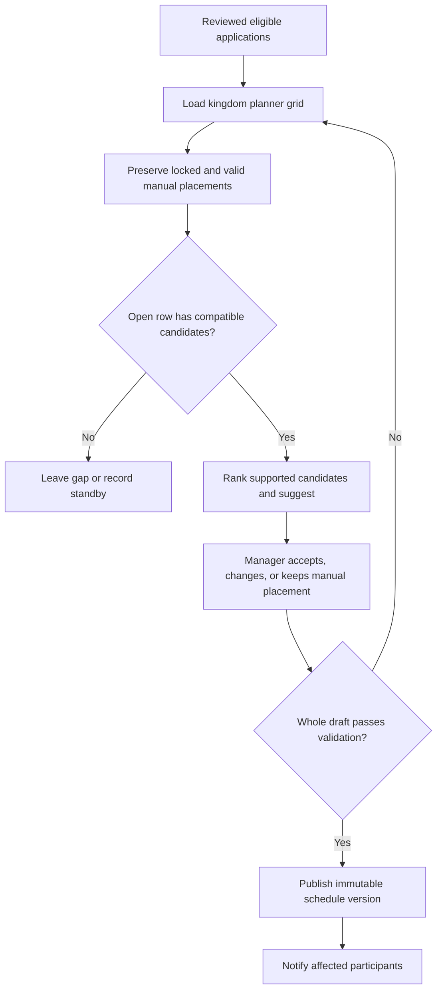

# Planning, Scheduling, and Publishing

The planner turns reviewed candidates into a dated schedule. Select the correct kingdom instance and stage before placing anyone.

## Read the planner

The stage navigator changes the active scheduling segment. Position columns represent configured castle positions; time rows represent stage slots. A cell can be **available**, **occupied**, or **reserved**. Player cards show the assigned candidate and visible fit or conflict information.

If a stage has no slots, set its date and slot count before scheduling. An empty earlier slot followed by a filled later slot produces a gap warning; saving can preserve an available gap, or the manager can compact or reserve it.

## Build and save a draft

1. Confirm stage dates, slot count, positions, and any required resources.
2. Place accepted candidates only into compatible times and positions.
3. Inspect overlap, duplicate, capacity, locked-slot, and availability feedback.
4. Lock an assignment that should not be moved by later suggestions.
5. Use suggestions as reviewable proposals. Apply, ignore, or replace them deliberately.
6. Save the draft and wait for the saved state. Unsaved changes remain a manager workspace and are not a participant schedule.

Automatic suggestions use configured candidate inputs and constraints, but managers remain responsible for identity, availability, fairness, and conflicts. The private scoring or placement algorithm is not public documentation.

## Publish

Run the visible validation or review summary. Resolve invalid or ambiguous assignments, then choose **Publish** when the complete draft is ready. Publication makes that version visible to participants and can trigger configured notifications. It does not lock every future change permanently.

After publication, make changes through the same planner. Save and republish or use the visible change workflow so participants see the new assignment. Moving, removing, or changing a time can produce a changed state and notification. Treat the latest published schedule as authoritative.

<VisualReference title="Castle schedule planner landmarks">
Read stage, positions, times, and publication state together.

<template #items>

- Instance and stage selector with stage date and slot configuration.
- Position columns, time rows, available, occupied, and reserved cells, and player cards.
- Candidate drawer, conflict badges, lock controls, suggestions, and gap actions.
- Unsaved or Saved draft state, validation summary, Publish action, and published version feedback.

</template>
</VisualReference>

## Purpose and decision workflow

Planning turns reviewed eligible applications into one conflict-checked kingdom schedule. A Minister of Justice, King, or other authorized planner selects the kingdom cycle, reviews the slot grid, preserves locked manual placements, and asks for suggestions only from candidates who remain eligible for that position and compatible with the open time. Candidate order can consider review state, preferred time, resource relevance, application priority, current placements, and the configured public-safe ranking rules. A full row, incompatible time, conflict, lock, or missing eligible candidate produces a gap or standby outcome rather than an invented placement.

*Planner structure and draft-to-publish decision. Suggestions do not bypass manager review or whole-draft validation.*

**Accessible summary:** Eligible applications enter a grid, locks are preserved, compatible candidates may be suggested, a manager decides placements, and only a fully valid draft publishes.

## Worked example, later change, and recovery

**Starting situation:** A preferred-time row becomes full before candidate Ilya is placed. Ilya is otherwise eligible. The planner eliminates the full row, finds no other compatible time, and leaves Ilya on standby. The manager does not widen Ilya's availability. After publication, another participant withdraws. The manager starts a controlled change from the current version, rechecks Ilya and all locks, places Ilya if the new slot qualifies, validates, and publishes the next version. The previous version remains historical and affected participants receive the supported notice.

The planner cannot see offline agreements, unsubmitted availability, or unrecorded resources. If publication fails, record cycle, row, position, conflict, locks, candidate state, and draft version. Resolve the source application or placement; do not duplicate the schedule.

## Limitations

Suggestion order cannot guarantee political fairness or a globally optimal schedule. It evaluates only recorded applications, resolved identity, eligibility, time choices, resources, locks, grid capacity, and configured ordering. Human reviewers remain responsible for exceptional context and for documenting a manual placement. Publishing validates product constraints, not an external promise that every participant will attend.

See [Statuses and Changes](/kingshot-events/castle-positions/statuses-and-changes) for the participant result and [Castle Position Problems](/kingshot-events/troubleshooting/castle-position-problems) for save or visibility issues.
