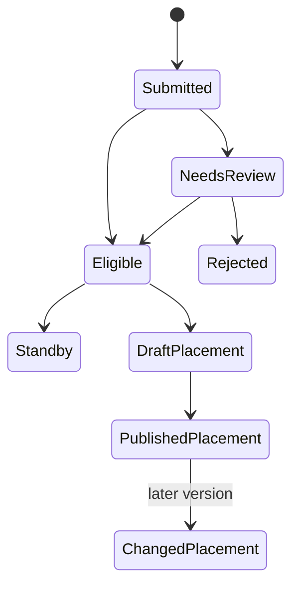

# Castle Position Statuses, Changes, and Notifications

Castle Positions has separate application and schedule states. **Accepted** describes an application; **scheduled** describes a placement; **published** describes the schedule version participants can use.

## Application period and application states

- **Open**: applications can be submitted or updated as the form allows.
- **Provisionally taken**: some times already have demand, but the form may still allow a request with a note.
- **Closed**: ordinary application changes are unavailable.
- **Submitted** or **linked**: received for review, with linked confirming the player association.
- **Standby**, **needs review**, or **under review**: identity or eligibility needs manager attention.
- **Accepted**: eligible for scheduling, without a guaranteed slot.
- **Rejected**: excluded from the current candidate plan unless reviewed again.

## Planner and participant states

- **Available**: an empty schedulable slot.
- **Occupied**: a player is assigned.
- **Reserved**: intentionally kept without a player.
- **Locked**: protected from ordinary moves or suggestions until a manager unlocks it.
- **Scheduled**: placed in the current draft or published schedule. Check publication state before relying on it.
- **Published**: visible participant version.
- **Changed**: an already communicated assignment was moved, removed, or had its time or stage changed.

## Participant perspective

Open **View my castle positions** after submission and again after publication. Your requested time remains provisional until the published schedule shows it. If a manager changes the schedule, the participant view reflects the latest published version.

Configured email can notify a player that an assignment was scheduled, removed, moved to another stage, or changed time. Email is a convenience, not the schedule record. Delivery can fail or arrive late, so confirm in the platform.

## Manager perspective

Save draft changes before publishing. After a published change, verify the new published version and the affected participant view. A test email or configured sender does not prove every participant received a message.

<VisualReference title="Castle status and change landmarks">
Distinguish the application badge from the schedule version.

<template #items>

- Application-period banner and applicant review status.
- Draft assignment state, slot state, lock, conflict, and unsaved or saved feedback.
- Published version or schedule-published marker.
- Participant assignment with stage, UTC time, position, and changed or removed notice.

</template>
</VisualReference>

If an update is missing, reload the correct kingdom instance and confirm it was published, not merely saved as a draft.

## State workflow and worked change

Application and schedule labels answer different questions. An application can be submitted, needs review, eligible, rejected, scheduled, standby, or closed. A placement can exist in draft without being participant-facing. A published schedule version remains authoritative until a controlled validated change publishes a successor.

*Castle statuses and change lifecycle. Eligibility, draft placement, publication, standby, and later versions are distinct.*

**Accessible summary:** Applicants pass review, may be rejected, standby, or placed in draft, and become participants only after publication.

**Worked example:** A participant withdraws. The manager starts from the current version, keeps unaffected locks, checks a standby candidate, places that candidate in draft, validates the grid, and publishes. Notices point to the new version while the former remains history. The system cannot infer offline availability or guarantee message delivery. Troubleshoot with cycle, applicant, state, row, lock, version, notice, and conflict.
