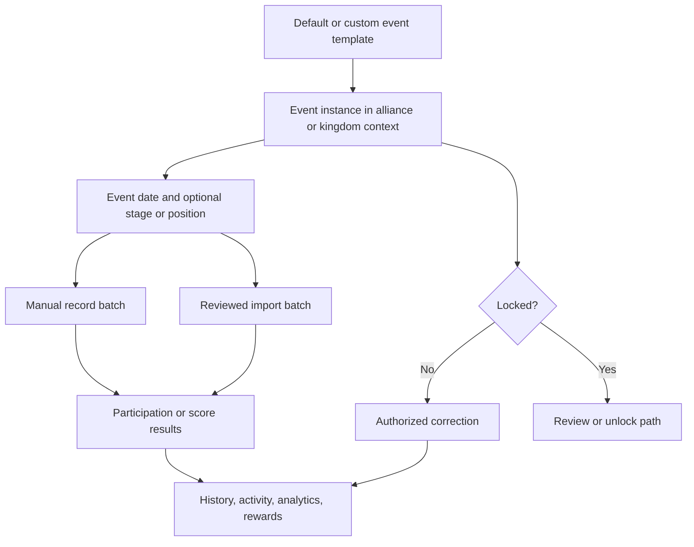

# Events and Results

<CategoryHero category="events" icon="flag" eyebrow="Keep configuration, occurrence, and evidence separate" title="Events and Results">
An event name describes a configured kind of activity. An event instance describes one occurrence in a scope. Results and record batches provide the player evidence attached to that occurrence.
</CategoryHero>

<ProductFinder default-category="Events and Results" />

## Product model

*Event data flow. Templates configure meaning; instances establish occurrence identity; batches preserve entry provenance; locks change the correction path.*

**Accessible summary:** A template creates an event instance with scope and date context. Manual or imported batches produce results used downstream. An unlocked instance can be corrected by an authorized user; a locked one requires the applicable review path.

## Important terminology and identity

A **default event** starts from product-provided behavior. A **custom event** is community-configured. A proposal is a requested configuration change until reviewed. An **instance** is not the template itself. Its identity includes the configured event, its alliance or kingdom context, and its occurrence information. A **stage** or **position** adds meaning where the event supports it. A **record batch** groups one save or applied import so users can trace where results came from.

Two uploads on the same date are not automatically harmless duplicates. The platform compares event, scope, date, player, result kind, and existing batch context. The review path may flag overlap, request overwrite or correction intent, or keep rows unresolved. Creating a second instance simply to bypass an existing locked or same-date occurrence fragments history.

## Main workflows

1. [Templates, instances, and results](/kingshot-events/events/overview) establishes the model and event modes.
2. [Instances, record batches, and corrections](/kingshot-events/events/record-batches-and-corrections) gives the complete identity and lock decision logic.
3. [Participation, scores, stages, and cumulative events](/kingshot-events/events/participation-and-scores) explains supported result shapes.
4. Enter data through [manual entry](/kingshot-events/events/manual-entry) or [imports](/kingshot-events/imports/).
5. Use [review and history](/kingshot-events/events/review-and-history) before interpreting [Analytics and Rewards](/kingshot-events/analytics/).

## Worked example: same date twice

**Starting situation:** Alliance Red already has a score batch for a configured event on 1 August. A contributor uploads another screenshot for that event and date. **Inputs:** Same scope, event, date, and several overlapping players. **Rules:** Existing identity and player overlap are checked before apply. **Branch:** Overlapping rows are treated as possible duplicates or corrections; genuinely new eligible rows can remain reviewable. **State:** Nothing should silently create a second authoritative result for an ambiguous row. **Output:** The reviewer chooses reject, correction or supported overwrite behavior row by row or batch-wide where allowed. **Next action:** Apply only after the batch preview reflects intent, then verify event history and recalculated downstream views.

## Mistakes, recovery, and limitations

- If the wrong date or scope was selected, stop before apply; after save, correct through the source batch or event history.
- If an event is locked, do not manufacture a replacement event. Use the authorized correction or unlock workflow.
- If Analytics is empty, verify saved results, eligibility, filters, date boundaries, event selection, and active scope.
- Template changes do not necessarily rewrite historical instances. Interpret an old result using its stored occurrence context.

The platform can enforce identity and workflow rules, but it cannot determine whether a screenshot depicts the intended occurrence without correct human context.
