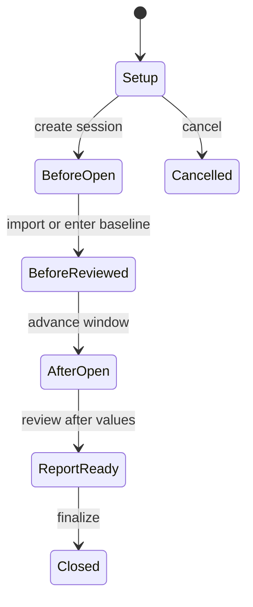

# Preparation and KvK Tracking

Preparation and KvK workspaces track a bounded session. They connect before and after power evidence, reminder timing, reviewed rows, and a growth report. Do not mix sessions merely because they concern the same kingdom.

## Session lifecycle

**Accessible summary:** Create a session, establish reviewed baseline values, collect reviewed after values, generate the comparison, and then close the session. Cancellation is separate from completion.

The workspace may offer screenshot processing when a permitted provider is healthy, plus manual setup or entry when supported. Provider availability changes how data enters review; it does not change the requirement to validate player identity and values.

## Review checklist

- Confirm the intended kingdom and the selected preparation session.
- Keep baseline and after evidence in their matching phase.
- Resolve unknown players, duplicates, unreadable values, and changed identities before applying.
- Review reminder windows and the visible reminder count; do not assume an external message was delivered.
- Interpret the report's percentage growth together with the absolute before and after values.
- Preserve the session identifier when reporting a problem.

Growth ordering can make a smaller account appear above a larger account. That is expected when the report is sorted by percentage gain. A missing baseline prevents a meaningful percentage comparison and must not be silently replaced with zero.

## Worked example

A player has 10 million power before the window and 12 million after it. The reviewed increase is 2 million and the relative gain is 20%. Another player gaining 3 million from 30 million has a larger absolute increase but a smaller relative gain. The reviewer uses the report's declared sort and keeps both values visible.

If no applicable session appears, verify that the expected event configuration exists for the selected kingdom. If processing is unavailable, use an allowed alternate entry path. If a report disagrees with evidence, reopen the underlying reviewed rows and phase assignments before changing the final report.

## Limits and troubleshooting

The growth report does not prove why power changed and cannot guarantee that every real player supplied evidence. Reminder counts describe configured or recorded reminders, not confirmed reading. A completed processing job can still contain incorrect candidates. When a session appears stuck, record its identity, phase, expected transition, current row counts, and the first validation message. Do not advance a phase merely to bypass unresolved names or values; correct the source rows or ask an authorized session manager.
