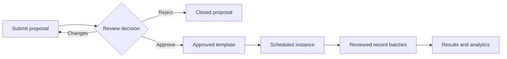

# Event Proposals, Templates, and Settings

An event proposal suggests a reusable definition. A template describes structure and result behavior. An instance schedules that definition for a real period. A record batch supplies observations. These are separate records with separate review boundaries.

## From idea to result

**Accessible summary:** A proposal must be reviewed before it becomes a reusable template. Scheduling and data entry happen afterward in their own records.

## What settings can affect

Authorized settings managers can configure event definitions, result types, stages or stage numbers, expected dates or recurrence, visible attributes, and reward-related behavior exposed by the settings workspace. A change to a template must not be assumed to rewrite historical instances or batches. Always inspect the effective configuration on the specific instance being reviewed.

Use proposals when the desired event does not yet have an approved definition. Include a clear name, purpose, expected schedule, stages, result meaning, and any special constraints. Reviewers should return ambiguous proposals for changes rather than guessing a scoring model.

## Decision table

| Situation | Correct action |
| --- | --- |
| Existing template fits | Create or use an instance; do not submit a duplicate proposal |
| Structure differs materially | Propose a new definition or request a reviewed settings change |
| One historic result is wrong | Correct its batch or row, not the global template |
| Stage is missing from entry | Check instance/template configuration before inventing a stage |
| Setting control is absent | Confirm permission and scope; do not recreate the event elsewhere |

**Example:** A contributor wants a two-stage variant of an existing one-stage event. They submit the stage model for review. Once approved, a manager schedules an instance. Old one-stage instances remain interpretable under their original configuration.

When a proposal or setting looks stale, reload and inspect its current status. Record the proposal or template identity, selected scope, intended rule, and visible validation message when escalating.
