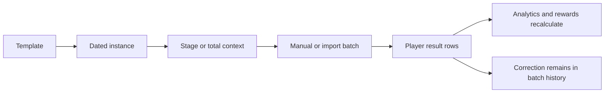
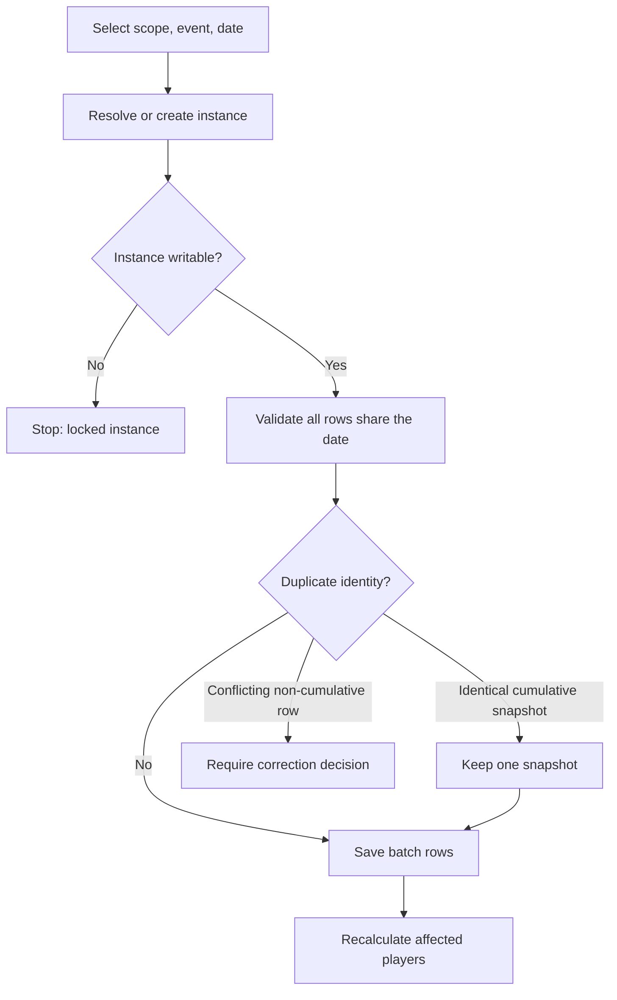
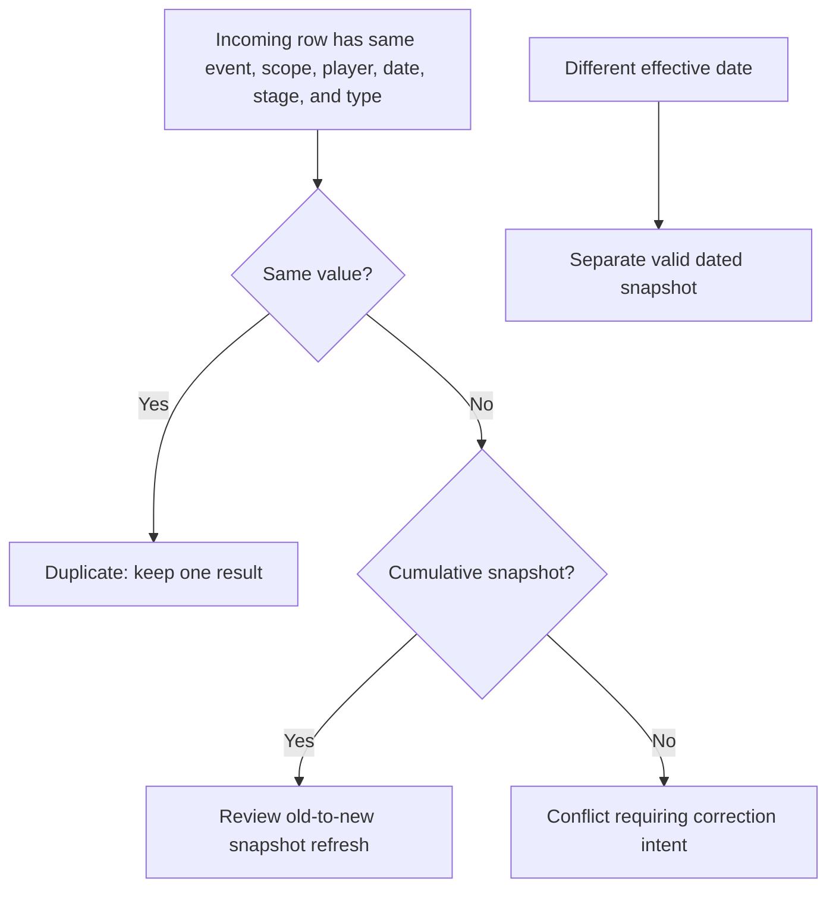
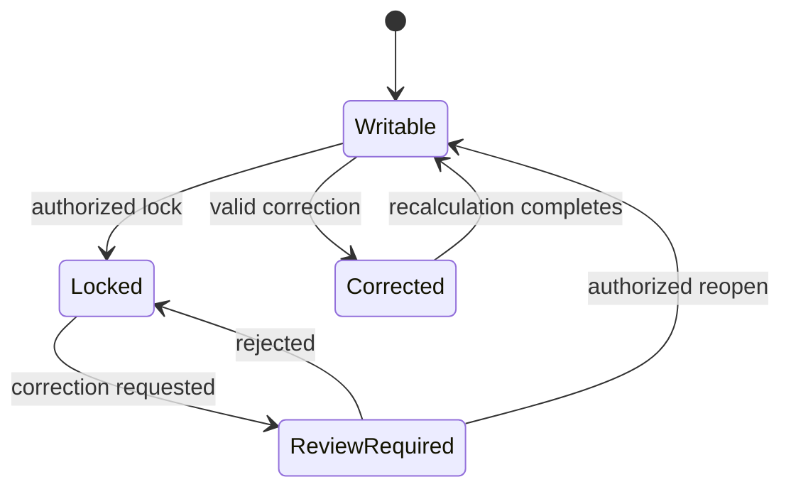

# Event Instances, Record Batches, and Corrections

An **event template** defines reusable behavior: scope, duration, stages, score-entry mode, required fields, activity participation, reward participation, and score rules. An **instance** is one dated run of that event. A **stage result** belongs to one stage or day; a **total result** stores the final or cumulative total. A **record batch** groups rows from one input action so reviewers can trace who entered them and which event, scope, date, session, stage, and source they used.

**Diagram summary:** Configuration becomes a dated instance; input is preserved as a batch; accepted player rows feed later calculations.

## Result identity and precedence

A result is identified conceptually by the instance when present, player, event, effective result date, stage identity, kingdom, alliance, result scope, and result type. Two rows cannot occupy the same identity. A correction that would collide with another current row is rejected rather than merged silently.

For a cumulative-total event, saving or accepting a different value on the same date refreshes that date's snapshot. It does not add the two totals. An identical value is a duplicate. For a non-cumulative event, a different same-context value is a conflict that requires an explicit overwrite decision. A new date creates or resolves a different snapshot inside the instance.

## Manual entry from start to finish

1. Select kingdom, then alliance. Role-bound selectors may be locked.
2. Select the event and one `YYYY-MM-DD` result date. Stage events also select Stage Data or Total Data, a stage number, and optionally a stage date.
3. Select an existing session or provide its start and end dates. The platform creates or reuses the compatible instance.
4. The alliance roster loads. For each player, enter a numeric score or leave it empty, an optional position, and Active, Inactive, or Unknown participation.
5. **Apply all changes** validates the batch quota, event visibility, writable instance, common date, player scope, numeric values, and duplicate identity.
6. The platform creates or reuses one manual-input batch for the same scope, event, instance, date, stage, and result type. Rows are inserted or updated according to the event mode.
7. A successful save opens the batch. Analytics recalculates for affected players.

**Accessible summary:** Manual entry resolves a writable event instance, validates date and row identity, handles duplicates or conflicts, saves one batch, and recalculates affected players.

**Worked participation example:** Aster records Viking Defense on 2026-08-01. Arin is Active with no score, Bea is Inactive, and Cato is Unknown. Apply All stores three participation rows in one batch. Activity calculations use them only if the template counts toward activity.

**Worked score example:** Alliance Mobilization uses cumulative totals. Nia has 25,000 on August 1 and 41,000 on August 2. Re-entering 43,000 for August 2 refreshes that snapshot; it does not produce 84,000. Re-entering 41,000 is treated as duplicate evidence.

## Locks, correction, and recovery

A locked instance rejects manual and imported writes. A manager must reopen or follow the authorized change path; changing the date to bypass a lock would create misleading history. Batch correction supports player, event, date, stage, score, position, custom fields, participation, review state, and ignored state, but validates the new identity before saving. After correction, affected analytics recalculate. If a save fails, no partial cross-date batch should be assumed: reopen the batch and verify which rows exist.

## Limitations

Autosave applies only where the interface explicitly shows it; the manual batch form commits through Apply All. Templates changed later do not retroactively rewrite completed evidence. Aggregate analytics are downstream views, not correction surfaces.

## Same-date and lock decisions

### Same-date duplicate, refresh, and conflict decision

*Same-date behavior. Value equality and event mode determine duplicate, refresh, or conflict.*

**Accessible summary:** Identical same-identity rows are duplicates; changed cumulative values can refresh a snapshot; changed non-cumulative values remain conflicts.

### Event lock and correction lifecycle

*Lock and correction flow. A lock sends changes through review instead of accepting a direct write.*

**Accessible summary:** Writable events accept valid corrections; locked events remain locked after rejection or reopen through an authorized decision.

The complete workflow ends by reopening the saved batch, confirming every intended row and status, and reproducing the downstream view with the same scope, event, stage, and date boundaries. That verification distinguishes a successful source correction from a stale Analytics display.
