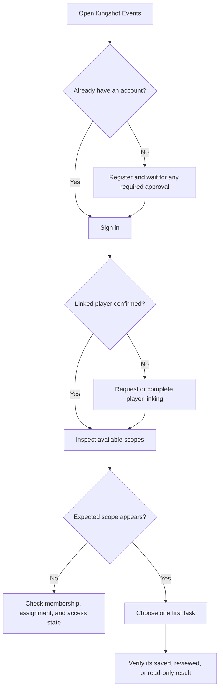

# Getting Started

<CategoryHero category="getting-started" icon="compass" eyebrow="Begin with the right identity and community" title="Getting Started">
Kingshot Events is scope-aware. A useful first session therefore confirms who you are, which game player record is linked to you, and which kingdom or alliance is active before opening data-entry or management tools.
</CategoryHero>

<ProductFinder default-category="Getting Started" />

## What this category helps you do

Start here to register, sign in, understand an approval state, connect an account to a game player, select an available community, and recognize why a navigation item may be absent. Registration creates a platform identity. It does not automatically create management authority, a subscription, or a verified player link.

*First-session decision path. Identity, link, and scope are separate gates, so resolving one does not imply the others.*

**Accessible summary:** The path branches for registration, player linking, and scope availability. A user proceeds to a real task only after the applicable gates are satisfied.

## Recommended reading order

1. [Your first visit, registration, and login](/kingshot-events/getting-started/first-visit) explains account states, password handling, and approval.
2. [Account, profile, and player link](/kingshot-events/getting-started/account-and-profile) separates the user account from the local player and linked game profile.
3. [Choosing scope and understanding access](/kingshot-events/getting-started/access-and-navigation) explains why the visible workspace changes.
4. Continue by role: [player or member](/kingshot-events/role-journeys/player-or-member), [alliance leader](/kingshot-events/role-journeys/alliance-leader), or [kingdom manager](/kingshot-events/role-journeys/kingdom-manager).

## A ten-minute first session

After signing in, open the account area and verify the displayed identity. If a player link is shown, compare its external player ID and current nickname with the intended game account; names alone are not reliable identifiers. Open the scope switcher, select a kingdom or alliance you actually belong to or manage, then open one existing record before changing anything. A member might inspect personal Analytics or a published Knowledge article. A manager might open the player directory or an event history view.

The first success signal depends on the task: a read-only view loads data for the chosen scope, an editable form shows a saved state, a review workflow shows the new status, or a publication workflow produces a distinct published version. Do not assume that leaving a form means it saved.

## Worked example

**Starting situation:** Mira has an approved account and manages an alliance, but the dashboard opens without alliance controls. **Checks:** She confirms the linked player, opens the scope switcher, and sees that her personal context is active. **Branch:** She selects the alliance assignment. **State change:** The active scope changes; her account and player link do not. **Output:** Alliance-scoped directory and event actions appear. **Reason:** Role, assignment, active scope, and feature availability now resolve together. **Next action:** She opens the player directory and checks its alliance label before editing.

## Common mistakes and recovery

- If an expected action is missing, check identity, active scope, assignment or membership, feature availability, and effective plan in that order.
- If a player name looks wrong, inspect the linked external ID and synchronization history before creating a second player.
- If a page is read-only, a shared Analytics grant may permit viewing without edit authority.
- If work does not show a saved confirmation, remain on the page and use the mechanism-specific recovery guide.

## Related product areas

[Scopes and Communities](/kingshot-events/scopes-and-communities/) explains context resolution. [Accounts and Access](/kingshot-events/accounts-and-access/) explains roles and approvals. [Troubleshooting](/kingshot-events/troubleshooting/) begins from the visible symptom.
