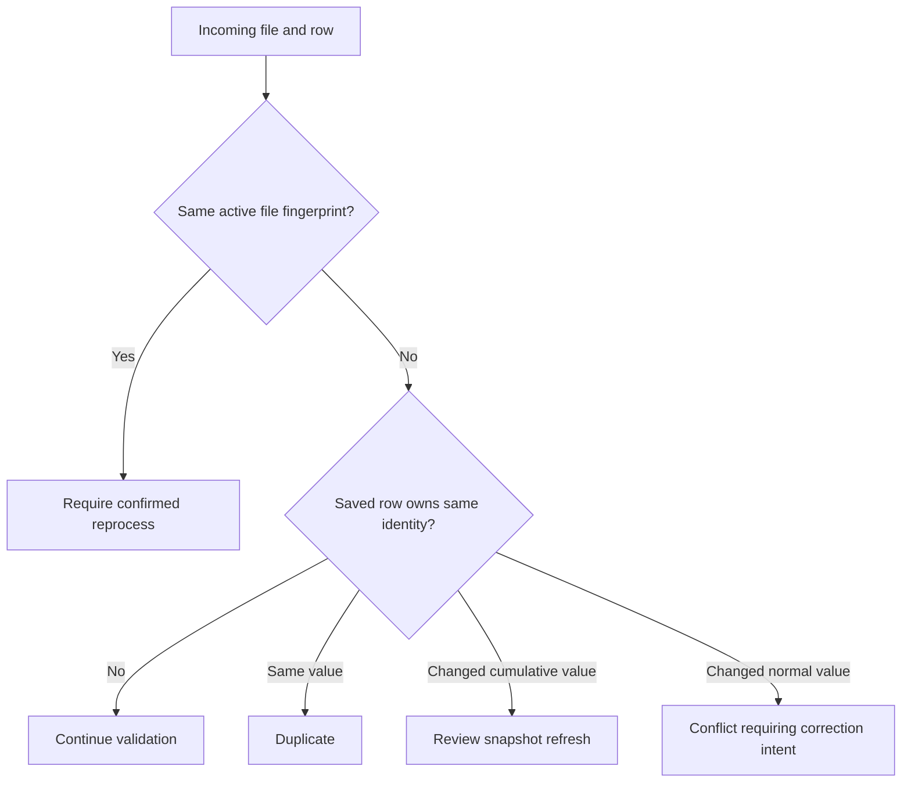

# Duplicate, Date, Overwrite, and Restore Rules

Import safety depends on three identities: the player, the event or session, and the event date. A similar name is not enough to prove a duplicate, and a second screenshot is not always a separate result.

## Player matching

Prefer an existing stable profile ID, then a confirmed current or historical nickname in the correct kingdom. A matched row updates the intended record; a created row adds a new identity. Resolve **unmatched player**, **low confidence**, and **conflict** states manually. Never create a second player just to accept a row faster.

## Same event and date

For event modes that keep one effective player result for an event instance or date, accepting a corrected row can replace or update the current value rather than append another independent score. Multi-stage and cumulative events also depend on the configured stage and score-entry mode. Confirm whether the screenshot represents a stage score or a cumulative total before acceptance.

After a replacement, Analytics uses the current saved record and recalculates affected summaries. Use import history, record batches, and event history to understand what changed.

## Delete choices

Authorized managers can choose **Delete Import** to hide the import record while leaving already created results intact, or **Delete (incl. Results)** when the supported impact review confirms that import-created results should also be rolled back. Read the visible impact preview and confirmation carefully. A rollback can remove records attributable to that import, but it cannot reconstruct unrelated edits that happened later.

## Restore

A deleted import can show **Restore**. Restoration returns the import record and its review history to view. It does not automatically recreate result rows that were explicitly removed with a rollback, rerun processing, or overwrite later corrections. Review **Saved results** after restoration to see what currently exists.

## Reprocessing

Do not assume every import can be reprocessed in place. If no current reprocess action is shown, correct rows manually or create a new import with the right context. Before uploading again, decide what will happen to already accepted rows and document the correction in the visible history.

## Safe correction order

1. Stop bulk acceptance.
2. Correct one wrong row in review when it has not been accepted.
3. For an accepted result, edit it from the review or event history when allowed.
4. Use rollback only when the impact preview matches the records that must be removed.
5. Reload Analytics after the saved correction and recalculation complete.

Related: [Reviewing Imported Data](/kingshot-events/imports/review-imported-data) and [Import Troubleshooting](/kingshot-events/imports/import-troubleshooting).

## Complete duplicate decision

These rules keep one file or row from silently replacing another piece of evidence. The reviewer confirms scope, event, date, stage, result type, and player; the platform compares active file fingerprints and saved result identity.

*Duplicate and same-date decision. File repetition and result identity are separate checks.*

**Accessible summary:** Repeated files need confirmation; same values duplicate; changed values become cumulative refresh or normal conflict.

**Worked example:** A cumulative row changes Nia from 25,000 to 28,000 on the same date. Acceptance refreshes the snapshot and preserves history. A normal score remains conflict until explicit overwrite. Delete, rollback, and Restore are different: deleting an import does not roll back results, and restoring it does not reapply rows. Limits include retention, dependent edits, locks, ambiguous identity, and quota. Include import, batch, scope, event, date, player, values, and state when troubleshooting.
