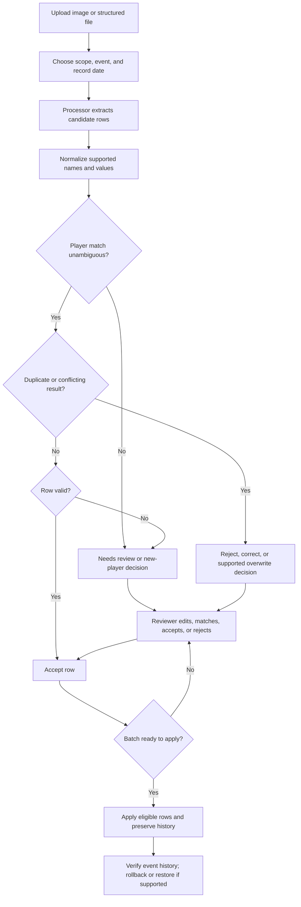

# Imports and Data Entry

<CategoryHero category="imports" icon="upload" eyebrow="Extraction proposes; reviewers decide" title="Imports and Data Entry">
Imports accelerate transcription, but extracted text is not authoritative. Event context, normalization, matching, duplicate checks, and review turn a file into eligible product records.
</CategoryHero>

<ProductFinder default-category="Imports and Data Entry" />

## Reconciliation pipeline

*Import reconciliation. Ambiguity and conflicts branch to human review; applying is distinct from accepting a row.*

**Accessible summary:** A file receives scope, event, and date context before extraction. Rows are normalized, matched, checked for duplicates and validation, reviewed, accepted or rejected, then applied as a traceable batch.

## Choose the right entry path

Use [manual entry](/kingshot-events/events/manual-entry) for a small number of known rows or when the source cannot be parsed reliably. Use [screenshot import](/kingshot-events/imports/screenshot-import) for a supported ranking image. Use structured input only for the supported format and fields described by [spreadsheet and structured input](/kingshot-events/imports/spreadsheet-and-structured-input). Every path still requires correct scope, event, date, and player identity.

The processor or provider may affect extraction availability and diagnostic messages, but it does not change the meaning of accepted records. Normalization removes supported presentational differences; it must not be treated as proof that two similar names identify the same player. Ambiguous names, missing values, unsupported formats, and low-confidence extraction remain review work.

## Row and batch states

Rows can be extracted, matched, unresolved, invalid, accepted, rejected, applied, or affected by rollback depending on the workflow. A reviewer correction changes the candidate row; it does not modify a game account. **Apply All** applies one supported choice across eligible rows and must not bypass invalid, ambiguous, duplicate, locked, or rejected states. Autosave preserves review progress where shown; it is not the same as applying the batch.

## Worked example: partial extraction

**Starting situation:** A ranking screenshot yields eight readable names, two uncertain names, and one unreadable score. **Inputs:** Correct alliance, event, and date. **Rules:** Clear rows continue to matching; ambiguous or invalid rows cannot be silently applied. **Branch:** Eight rows become reviewable matches, two require player selection, and one requires score correction or rejection. **State:** The batch remains partially reviewed. **Output:** The reviewer corrects one name, rejects the unreadable row, accepts the rest, then applies the eligible subset. **Next action:** Compare event history with the source image and retain the batch history for later recovery.

## Common mistakes and recovery

- A duplicate screenshot can produce overlapping proposals; inspect event, date, player, and existing result identity before applying.
- If the wrong context was chosen, reprocess with correct context before apply. After apply, use batch history and the supported rollback or correction path.
- Deleting an import is not the same as rolling back records already created from it.
- Restoring a deleted import does not necessarily reapply rows; inspect its state and linked records.
- Partial provider failure may leave a recoverable import with diagnostics. Do not repeatedly upload the same file until you know whether a batch was created.

Continue to [row states and decisions](/kingshot-events/imports/row-statuses-and-decisions) for exact review order and [import troubleshooting](/kingshot-events/imports/import-troubleshooting) for symptom-based recovery.
