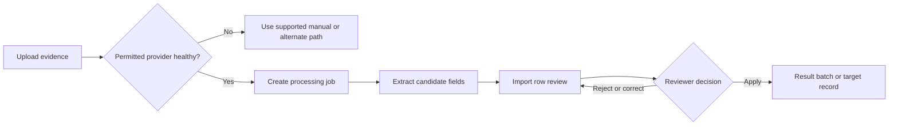

# Processing Console and Provider Health

Image processing converts submitted evidence into candidate data. The Processing Console and provider-health views explain whether the configured processing services are available and how jobs progress. Successful extraction is not approval to apply rows.

## Processing boundary

**Accessible summary:** A healthy provider extracts candidates; a human review still decides what becomes product data.

Provider status can be enabled, disabled, unavailable, misconfigured, or otherwise unhealthy as exposed by the console. Jobs can be queued, processing, completed, or failed. Use the exact current status rather than repeatedly uploading the same evidence.

## Operator procedure

1. Check the processing category and provider status.
2. Open the existing job and read its error before retrying.
3. Retry only when the failure is transient or the corrected configuration is active.
4. Use manual entry when the product offers it and processing remains unavailable.
5. Review extracted names, dates, stages, values, and duplicates before apply.

**Example:** A job fails because no provider is healthy. The operator does not create five duplicate imports. They confirm provider health, choose the supported manual path for urgent data, and later retry the original job only after service recovery.

When escalating, include the job or import identifier, provider category, current status, safe error text, time, and whether a manual fallback was used. Never include provider secrets or protected image contents in a public report.

## Limits and troubleshooting

Provider health does not guarantee correct extraction, and a failed health check does not prove that stored imports were lost. The console is diagnostic; row approval remains in the import review. If a job stays queued, confirm that an eligible provider is enabled for its category and inspect the existing job before retry. If a completed job has no candidates, verify the evidence format and processing output rather than applying an empty import.
