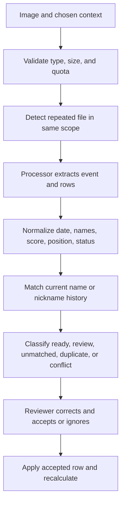

# Screenshot Reconciliation and Row Decisions

The processor extracts candidates; it does not write trusted results. Every extracted row is normalized and staged for human review. Provider confidence is only one signal. Event context, player matching, duplicate identity, score range, and existing records can all force review.

## Decision order

1. The image must satisfy file-type and size rules, and the selected scope must have upload, import, and storage capacity.
2. A file fingerprint is checked against active imports with the same import type, scope, and event date. Reprocess requires explicit confirmation.
3. The selected provider extracts an event title, date, and rows. A manually selected event or date takes precedence over detection. Missing dates fall back visibly and require review. A detected title that disagrees with the selected event also requires review.
4. Names are cleaned and normalized. Blank or unclear names become `needs_review`.
5. Matching considers current names and nickname history inside the selected context. No match becomes `unmatched_player`; accepting can create a player, while rematching connects the row to an existing one.
6. Missing scores, low extraction or match confidence, processor warnings, out-of-range scores, and review flags prevent automatic trust.
7. Within one import, a repeated player/event/date/stage/result-type identity becomes `duplicate`.
8. Against saved data, an equivalent row becomes `duplicate`. A different non-cumulative row becomes `conflict`. A different cumulative snapshot becomes `ready` with an explicit old-to-new refresh note.

| Row state | Meaning | Safe action |
| --- | --- | --- |
| Ready | Context and match are usable, but no result is written yet | Compare the image and accept |
| Needs review | One or more values are uncertain | Correct the fields, then reassess |
| Unmatched player | No current or historical name match | Rematch or intentionally create |
| Low confidence | Extraction or player match confidence is weak | Read the source rather than trusting the guess |
| Duplicate | Equivalent evidence already exists | Ignore unless the identity is wrong |
| Conflict | A different result owns the same identity | Choose whether the incoming evidence should overwrite |
| Ignored | Reviewer deliberately excluded the row | Restore to review only when evidence changes |

**Worked correction:** The image says `CRON 123,456,789`, but the roster now calls the player Horus. Nickname history matches CRON to Horus. The row is staged, the reviewer confirms the image and accepts, and the result attaches to Horus. No CRON player is created.

**Worked same-date case:** A cumulative event already stores 25,000 for Nia on August 1. A new screenshot reads 28,000 for the same date. The row says that accepting will refresh 25,000 to 28,000. For a normal score event, the same mismatch is a conflict and is not overwritten until accepted.

## Failures and recovery

Zero extracted rows, unsupported images, missing provider credits, or processing errors leave a visible failure or review state. Reprocessing creates another processing attempt only after confirmation; it does not prove the earlier rows were wrong. Deleting an import and rolling back applied records are different actions: deletion concerns the import artifact, while rollback concerns results created or changed from it. Use batch history to inspect impact before rollback. Restoration can return eligible soft-deleted records, but cannot reconstruct a source image that retention has permanently removed.

Provider-specific credentials are passed only to the selected processing attempt and are not documented here. Extraction can misread names, digits, ordering, or cropping. Manual review remains mandatory.

## Limitations

An accepted row proves only that a reviewer chose to apply the staged evidence; it does not certify perfect extraction. A crop can omit players, a nickname can still be ambiguous, and rollback may be unavailable after retention expires or later dependent edits exist. Preserve the source image long enough to resolve review flags, then compare the resulting batch before treating analytics as final.
