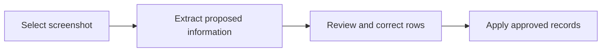

# Screenshot Import
Screenshot import assists data entry; it does not guarantee correct recognition. Start from **Imports**, choose the correct scope and supported category, upload a clear image, and wait for the extracted rows.

Never apply extracted information without reviewing player names, dates, stages, participation, and scores. Unsupported images, cropped labels, overlays, or low resolution can produce incomplete results.

<RolePerspective>

### As a contributor

Select the correct scope, upload the supported image, and correct every proposed row before applying it.

### As an alliance manager

Confirm that the proposed players and event records belong to the intended alliance, then verify corrections against the source.

### What the platform does automatically

It processes the submitted image, prepares structured information, and surfaces a review step. It does not certify that recognition is correct.

</RolePerspective>
<VisualReference title="Screenshot Import orientation">
Use the current page labels and confirm context before acting.

<template #items>

- Active scope or profile.
- Primary input and review area.
- Visible save, submit, result, or status feedback.

</template>
</VisualReference>

## Related guides

- [review imported data](/kingshot-events/imports/review-imported-data)
- [import problems](/kingshot-events/troubleshooting/import-problems)
