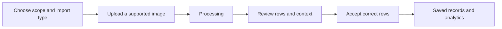

# Screenshot Import

Screenshot import converts a supported leaderboard or roster image into proposed rows. Processing is assisted data entry: no extracted row is trustworthy until a person checks the context, match, values, and date.

## Before uploading

1. Open **Imports** inside the intended kingdom and alliance.
2. Confirm the import category and target event or session. For multi-stage or cumulative events, confirm the stage and whether the screenshot contains a stage value or a cumulative total.
3. Use an uncropped, readable screenshot with names, headings, and values visible. Remove chat overlays and avoid combining unrelated panels.
4. Check that you are allowed to contribute to the selected scope and that its usage limit is available.

## Processor choices

The application groups available processors into **Free**, **With Keys**, and **Premium** choices. The cards show current availability and explain what setup is required. A browser-held provider key, when supported, remains a user setup choice and should never be pasted into documentation, support screenshots, or review notes. Premium processing appears only when the effective plan and quota allow it.

Processor availability can change without changing the import workflow. Choose an available option, review its visible notice, and do not assume one provider is more accurate for every screenshot.

## Upload and processing

Choose a file, drag and drop it, or use the supported clipboard flow. Submit once. The import moves through visible states such as **draft**, **processing**, **review required**, **accepted**, **rejected**, **deleted**, or a failure state. Leave the record in history while it processes; repeated uploads can create duplicate review work.

When processing completes, open **Import Review**. The page shows the source image, processor label, detected and assigned event context, and counts for **Detected**, **Matched**, **Saved**, and **Need review**. A warning appears when the detected screenshot title differs from the assigned event.

<VisualReference title="Screenshot upload landmarks">
Verify the context summary before selecting a processor or image.

<template #items>

- Kingdom, alliance, event or session, import category, date, and stage or total controls when applicable.
- Processor cards grouped by current availability, with setup or quota feedback.
- File, drag-and-drop, or clipboard upload area and processing status.
- Link to **Import Review** with the screenshot, context warning, and row summary.

</template>
</VisualReference>

## Do not continue when

Stop before accepting rows if the alliance, event, date, stage, title, or screenshot type is wrong. Correcting the context before acceptance is safer than trying to repair many saved results later.

Next: [Reviewing Imported Data](/kingshot-events/imports/review-imported-data).
