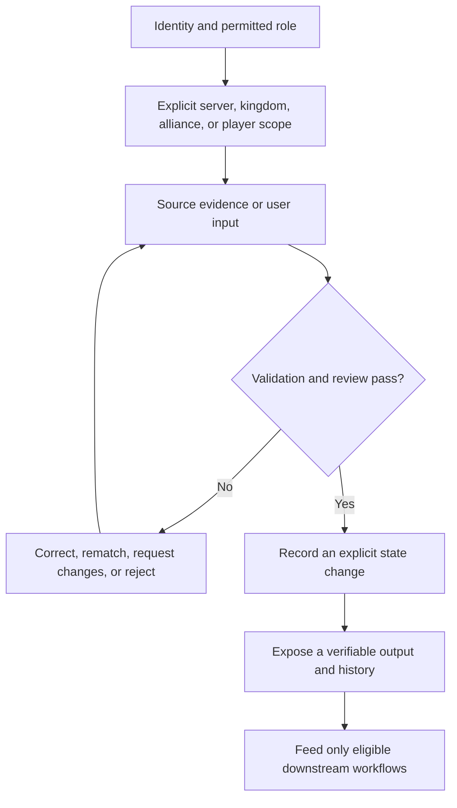
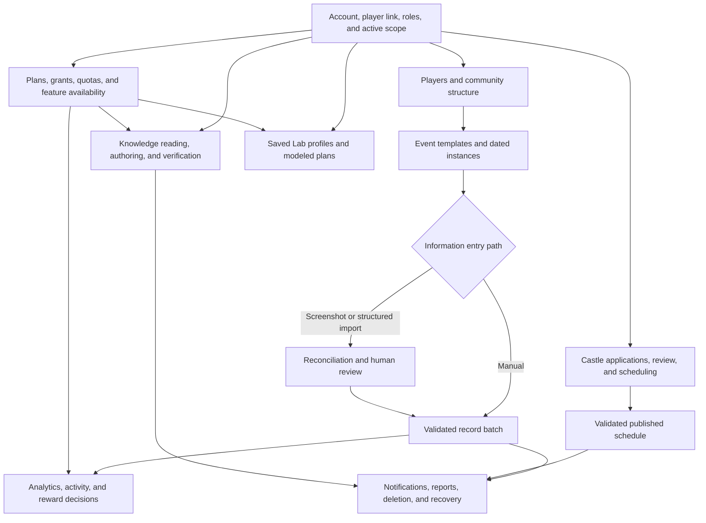

# Kingshot Events
Kingshot Events helps communities keep player and event information structured across kingdoms and alliances. It combines data entry, review, reporting, Castle Position coordination, shared knowledge, and planning tools. Automation assists some tasks, but contributors and managers still review important information.

## What this project is for

Kingshot communities coordinate people, event evidence, decisions, schedules, guides, and progression plans. Without one shared operating model, the same player can appear under several names, screenshots can be interpreted differently, a correction can be applied to the wrong event date, reward decisions can lose their evidence, and published schedules can drift away from the version participants received.

Kingshot Events turns that scattered work into traceable workflows. It does not merely store totals. It gives each important piece of information an identity, scope, state, review boundary, and destination:

- a player belongs to a server, kingdom, and alliance context and can preserve identity through name or membership changes;
- an event definition is separated from the dated instance in which players participate;
- manual and imported evidence becomes a record batch whose rows can be reviewed and corrected;
- analytics and reward decisions derive from accepted source records instead of detached copied totals;
- Castle Position applications remain requests until review, planning, validation, and publication produce an authoritative schedule;
- Knowledge articles move through draft, review, publication, revision, archive, and optional reading-assignment workflows;
- Lab profiles and scenarios make progression or combat assumptions reproducible without pretending to control the game account;
- reports, notices, recycle-bin records, and restore requests preserve operational follow-up.

The project solves two problems at once. It helps a user complete an immediate task and helps the community explain later what happened, under which scope, from which source, and through which decision.

## The operating promise

Every workflow is designed around five questions:

1. **Who is acting?** The account, linked player, role, and approval state determine authority.
2. **Where does the work belong?** Server, kingdom, alliance, and player context prevent drift.
3. **What is the source?** A form, screenshot, spreadsheet, application, draft, or profile remains identifiable.
4. **What decision changed the state?** Review, correction, approval, publication, rejection, archive, or restore is explicit.
5. **What can the user verify?** The page exposes a record, status, history, report, schedule version, revision, or modeled result.

**Accessible summary:** Authorized users work in an explicit scope, provide source evidence, resolve review problems, record a state change, verify its output, and only then feed downstream workflows.

## A complete demonstration: from community setup to trusted result

The following fictional journey shows how the modules cooperate. Names and numbers are examples; workflow boundaries are the important part.

### Step 1: establish identity and community context

Mira confirms that her account is approved and linked to the intended player. The header shows server, kingdom, and alliance. She is an alliance leader in Aster, not a manager of every alliance visible in comparisons.

Read-only analytics access does not automatically become roster or import authority. Every action still resolves assignment, role, module status, and plan.

**Verifiable output:** account identity, player link, active scope, and available actions agree.

### Step 2: build one durable player record

Aster already contains Nia under a former nickname. Mira searches current names, nickname history, and supported external identity before creating a record. She opens the existing profile and updates only locally controlled fields.

If Nia changes alliance, **Kick** changes membership without erasing history. **Delete** is different and enters recoverable soft deletion when supported. Recreating Nia would split results and rewards.

**Verifiable output:** one profile preserves identity, membership history, activity evidence, and linked-account state.

### Step 3: define the event context

The community uses an approved template describing result type and stages. A manager selects the dated event instance. The instance, not the generic template, anchors participation.

If no suitable template exists, a contributor proposes one. Approval creates reusable configuration; it does not rewrite older instances.

**Verifiable output:** event, instance, date, stage, scope, and writable or locked state are visible before entry.

### Step 4: bring in evidence

Mira enters rows manually or uploads supported evidence. Screenshot processing validates file and quota conditions, detects repetition, extracts candidates, normalizes values, and tries to match current or historical player names.

Extraction is not acceptance. Rows can be ready, uncertain, unmatched, duplicate, conflicting, ignored, accepted, or applied. An unfamiliar name stays unresolved until reviewed.

**Verifiable output:** import review shows every row, context, status, reason, and intended player before apply.

### Step 5: save a traceable record batch

Accepted rows become a batch connected to the instance and date. Manual entry follows the same boundary: validate context, identify duplicates or conflicts, save rows, and preserve correction history.

If a value is wrong, Mira corrects the source batch. She does not add another result to force analytics. Locked instances use correction or reopen decisions.

**Verifiable output:** the batch contains intended players and values, and history explains corrections.

### Step 6: interpret analytics and rewards

Analytics applies access, scope, date, event, stage, type, participation, and attribute filters before grouping. Missing evidence is not zero. Unknown participation is not Active.

Mira drills from an aggregate to contributing records. Reward decisions use eligible evidence and visible rule order; analytics rank itself is not an award.

**Verifiable output:** totals trace to source rows, filters are reproducible, and a reward has a distinct state and reason.

### Step 7: coordinate Castle Positions

Applicants provide identity, availability, times, and supported resource information. Review resolves uncertainty. The planner preserves protected assignments and reports conflicts and gaps.

A suggestion is not an appointment. Managers resolve gaps, validate, and explicitly publish. Later changes create a controlled successor.

**Verifiable output:** an appointment exists only in the current published schedule version.

### Step 8: publish shared knowledge

An author creates a draft, previews it, resolves validation, and submits it. A reviewer inspects changes and full content, then requests changes, rejects, approves, or publishes. Editing a published guide creates a new draft while the prior publication remains live.

If Reading Verification applies, the reader reaches a collapsed seal and explicitly chooses **Open seal** before assignment verification returns the fragment. Reaching the marker reveals nothing.

**Verifiable output:** readers get the canonical permitted revision; managers get assignment progress without another article copy.

### Step 9: compare plans in the Lab

Mira selects the correct device or cloud profile and opens an optimizer or simulator. Profile data describes reusable assumptions; scenario fields describe this experiment. Versioned catalog data supplies costs and stats.

Optimizers return ordered steps and leftovers. Rally and Battle expose participants, effects, sides, trials, and assumptions. Outputs are models, not game writes or guarantees.

**Verifiable output:** the result preserves profile, scenario, version where exposed, steps or distribution, and limitations.

### Step 10: recover and explain

If something fails, return to the owning source: account for access, profile for identity, batch for results, import review for extraction, reward record for decisions, schedule version for appointments, article revision for Knowledge, or profile and scenario for Lab.

Reports track issues; restore requests handle recoverable deletion. A resolved report does not restore data. Alerts point to records and are not authoritative state.

**Verifiable output:** correction occurs in the owning workflow and downstream views refresh from the repaired source.

## What the project deliberately does not do

Kingshot Events does not guarantee extracted text, identical permissions across communities, an unchanging published schedule, perfect browser translation, or exact reproduction of undocumented live mechanics. It does not turn read visibility into edit authority and does not treat a dashboard count as the source record.

These boundaries make uncertainty visible and provide a safe next action instead of presenting automation as unquestionable truth.
<ProductFinder />

## Complete product capability guide

Kingshot Events is not one isolated tracker. It is an operating workspace that connects identity, scoped collaboration, event preparation, contribution intake, review, analytics, knowledge, and planning. The list below is the fastest way to understand what the project can do and where each result comes from.

### Dashboard and orientation

The dashboard answers three questions first: **where am I working, what needs attention, and what can I do next?** The selected kingdom or alliance gives every card its context. Visible navigation depends on identity, role, plan, grants, quotas, and module availability. Empty states lead to setup or recovery instead of pretending that missing data is a zero.

### Accounts, security, roles, and approvals

Accounts establish identity; roles establish authority inside a scope. Registration, sign-in, verification, recovery, session management, and deletion are separate lifecycle operations. Invitations and join requests create reviewable membership changes. Elevated actions require the appropriate kingdom or alliance role, while platform administration remains distinct from community administration.

### Server, kingdom, alliance, and player scopes

Server records hold the broad game context. Kingdoms and alliances narrow ownership and collaboration. Players can move between alliances without losing the historical meaning of earlier contributions. Every important record should be read with its scope, owner, timestamp, and current state; a matching name alone is not enough evidence.

### Players, identity, membership, and history

Player records connect game identity to imports, event participation, rewards, and analytics. Membership history explains which alliance a player represented at a particular time. Aliases and identifiers help reconcile repeated imports without silently merging different people. Corrections remain deliberate so that a convenient edit cannot rewrite historical attribution unnoticed.

### Events, templates, instances, sessions, and proposals

A template describes reusable rules. An event instance places those rules into a kingdom or alliance schedule. Sessions divide collection or participation into operational windows. Proposals allow contributors to suggest changes that reviewers can accept, reject, or return. Status transitions distinguish draft preparation, active collection, completion, archive, and recovery.

### Manual entry and correction

Manual entry is the smallest trustworthy input path. The contributor selects the correct event and scope, enters the requested values, reviews validation feedback, and submits. Reviewers resolve duplicates or suspicious values before accepted data affects downstream views. A correction should preserve who changed what and why.

### Screenshot, spreadsheet, and structured imports

Bulk intake accelerates work but never removes review. Screenshot extraction proposes fields from an image. Spreadsheet import maps columns and previews rows. Structured import parses supported data into editable candidates. In every case, the operator confirms scope, resolves uncertain identities and duplicates, and commits only the reviewed subset.

### Preparation and KvK workflows

Preparation tools turn event rules into an actionable checklist: phases, objectives, timing, assignments, and expected contribution. KvK workflows preserve the relationship between preparation activity and its event context. They help coordinators organize work; they do not claim that the platform performs actions inside the game.

### Analytics, activity, recommendations, and rewards

Analytics summarize accepted evidence rather than raw submissions. Activity views show participation and change over time. Recommendations explain the inputs and assumptions behind a suggested next action. Reward tooling records rules, eligibility, calculations, approvals, and delivery state so that a final number can be traced back to its evidence.

### Castle applications and schedules

Castle workflows collect applications, availability, and scheduling decisions in one scoped process. The platform separates a player's request from the coordinator's decision and from the published schedule. Conflicts and changes remain visible so participants can understand the current assignment.

### Knowledge Hub

Knowledge Hub is the governed publishing system. It combines searchable guides, structured hero/event/mechanic references, spaces, rich block-based authoring, media assets, assisted drafting and import, review queues, revision comparison, publication, archive, access policies, translation assistance, and Reading Verification. Readers receive only the projection their identity and access permit.

### Lab

Lab is the planning and simulation workspace. Reusable profiles hold troops, heroes, skills, combat statistics, equipment, resources, and provenance. Hero Gear, Governor Gear, Charms, Bear Trap, Rally, Battle, and Game Data tools compare explicit scenarios and preserve their assumptions. Results are planning evidence, not promises of live-game outcomes.

### Plans, grants, quotas, and support requests

Effective access can come from a direct plan or an accepted grant. Quotas limit specific consuming operations without changing historical data. When expected access is missing, support and grant workflows provide a reviewable path instead of encouraging users to bypass policy.

### Reports, notifications, deletion, and recovery

Reports package authorized views for operational use. Notifications point users to changes that concern their scope. Deletion is a lifecycle with confirmation and retention boundaries, not an invisible disappearance. Archive, restore, retry, and support paths are documented beside the normal path because recovery is part of a reliable product.

### Updates and module availability

Release information explains what changed, while availability controls explain whether a module is enabled for the current environment and user. A navigation item may be absent because of scope, role, rollout, entitlement, or configuration. The correct response is to inspect availability and access, not to assume the underlying records were deleted.

## How to evaluate any feature

Use the same evidence chain throughout the product:

| Question | What to verify |
| --- | --- |
| Identity | Which signed-in account performs the action? |
| Scope | Which server, kingdom, alliance, player, event, or article owns the record? |
| Availability | Is the module enabled and visible for this context? |
| Input | Was the value entered manually, imported, selected from a profile, or derived? |
| Validation | Which required fields, ranges, duplicates, and permissions were checked? |
| Review | Does a proposal, import, publication, reward, or application need approval? |
| State change | What moved from draft to submitted, accepted, published, completed, or archived? |
| Output | Is the result a record, schedule, report, recommendation, simulation, or assignment? |
| History | Can the user identify the revision, actor, timestamp, and source evidence? |
| Recovery | Can the action be corrected, retried, restored, or escalated without inventing data? |

This model is the thread connecting every guide. When a page describes a feature, it should explain not only the button path but also the evidence accepted, the state changed, the output produced, and the safe recovery route.
## Explore by product area

<LinkGrid :items='[
  {"title":"Getting Started","description":"Identity, player link, scope, and a useful first task.","href":"/kingshot-events/getting-started/"},
  {"title":"Accounts and Access","description":"Approval, roles, assignments, availability, grants, and access outcomes.","href":"/kingshot-events/accounts-and-access/"},
  {"title":"Scopes and Communities","description":"Server, kingdom, alliance, player hierarchy, and cross-scope visibility.","href":"/kingshot-events/scopes-and-communities/"},
  {"title":"Players","description":"Directory, identity, linking, sync, status, membership, removal, and restore.","href":"/kingshot-events/players/"},
  {"title":"Events and Results","description":"Templates, instances, dates, stages, batches, locks, and corrections.","href":"/kingshot-events/events/"},
  {"title":"Imports and Data Entry","description":"Manual, screenshot, and structured entry with reconciliation and rollback.","href":"/kingshot-events/imports/"},
  {"title":"Analytics and Rewards","description":"Kingdom, alliance, player, and custom views plus reward decisions.","href":"/kingshot-events/analytics/"},
  {"title":"Castle Positions","description":"Applications, review, candidate logic, planning, publication, and changes.","href":"/kingshot-events/castle-positions/"},
  {"title":"Knowledge Hub","description":"Reading access, translation, authoring, review, revisions, and verification.","href":"/kingshot-events/knowledge-hub/"},
  {"title":"Simulations and Optimizations","description":"Saved profiles, progression optimizers, Bear Trap, and result limits.","href":"/kingshot-events/lab/"},
  {"title":"Subscriptions and Usage","description":"Plans, accepted grants, allocations, quotas, limited mode, and suspension.","href":"/kingshot-events/subscriptions/"},
  {"title":"Shared Lifecycles","description":"Notifications, reports, deletion, recycle bin, and restoration.","href":"/kingshot-events/lifecycles/recycle-bin-and-restore-requests"},
  {"title":"Role Journeys","description":"Task paths shaped around player, alliance, kingdom, editorial, and session roles.","href":"/kingshot-events/role-journeys/player-or-member"},
  {"title":"Troubleshooting","description":"Symptoms, safe checks, recovery, and support evidence.","href":"/kingshot-events/troubleshooting/"},
  {"title":"Updates","description":"User-facing changes and documentation impact.","href":"/kingshot-events/updates/release-notes"}
]' />

## Choose your role

<LinkGrid :items='[
  {"title":"Player or member","description":"Profile, personal results, rewards, applications, articles, and Lab tools.","href":"/kingshot-events/role-journeys/player-or-member"},
  {"title":"Alliance leader","description":"Roster, entry, imports, corrections, Analytics, and rewards.","href":"/kingshot-events/role-journeys/alliance-leader"},
  {"title":"Co-leader","description":"Delegated alliance tasks and leader handoff boundaries.","href":"/kingshot-events/role-journeys/co-leader"},
  {"title":"King or kingdom manager","description":"Cross-alliance views, shared access, and kingdom workflows.","href":"/kingshot-events/role-journeys/kingdom-manager"},
  {"title":"Minister of Justice","description":"Castle applications, conflicts, schedule drafts, and publication.","href":"/kingshot-events/role-journeys/minister-of-justice"},
  {"title":"Knowledge author or reviewer","description":"Drafts, blocks, review decisions, publication, and revisions.","href":"/kingshot-events/role-journeys/knowledge-author"},
  {"title":"Reading-session manager","description":"Assignments, progress, classification, reports, close, and archive.","href":"/kingshot-events/role-journeys/reading-session-manager"}
]' />

## Problems it helps solve

- Maintain player records without relying on scattered sheets and message threads.
- Collect participation or score information through manual entry and supported screenshot imports.
- Review activity, event history, and reward eligibility in the correct scope.
- Coordinate Castle Position applications, decisions, schedules, and publication.
- Share structured guides through Knowledge Hub.
- Compare modeled progression choices in the Lab without treating estimates as guaranteed outcomes.

## How the parts work together

*Complete Kingshot Events product map. Identity and scope feed records and specialized workflows; subscriptions affect feature access; shared lifecycles preserve downstream state and recovery.*

**Accessible summary:** Account and scope lead to player, event, Castle, Knowledge, and Lab workflows. Reviewed batches feed Analytics and rewards, subscriptions affect availability, and shared lifecycles handle notices and recovery.

Player information belongs to an alliance and kingdom context. Event results connect a player to a configured event occurrence. Reviews and reports use that same context so authorized users see the intended community data.

Information enters the platform through manager forms, manual result entry, spreadsheet or screenshot imports, Castle Position applications, Knowledge drafts, and Lab profiles. Each path has its own review boundary. Import rows are proposals until accepted, Castle Position applications are requests until reviewed and published, Knowledge edits remain drafts until publication, and Lab inputs remain planning assumptions until the user confirms them.

After review, the same scoped records support downstream work:

- Saved player and event results feed player history, alliance and kingdom Analytics, activity status, and reward eligibility.
- Reviewed Castle Position applications feed the candidate workspace and draft planner; publication produces the participant schedule.
- Published Knowledge revisions become searchable for their intended public, kingdom, alliance, or premium audience.
- Saved Lab profiles supply consistent inputs to progression and combat modules, but never update the game account.

## Where to begin

| You want to... | Start here | Then continue to... |
| --- | --- | --- |
| Join and find your personal information | [Your First Visit](/kingshot-events/getting-started/first-visit) | Account profile, player link, My Analytics, rewards, or appointments |
| Maintain an alliance roster | [Player Directory](/kingshot-events/players/directory-and-profiles) | Add or sync players, lifecycle actions, then alliance analytics |
| Record an event | [Event Tracking](/kingshot-events/events/overview) | Manual entry or screenshot import, review, history, analytics, and rewards |
| Coordinate Castle Positions | [Castle Positions](/kingshot-events/castle-positions/) | Applicant or review guide, planner, publication, and participant changes |
| Read or publish a guide | [Knowledge Hub reading](/kingshot-events/knowledge-hub/reading-and-finding) | Access, Reading Verification, or Studio authoring |
| Compare progression or combat choices | [Lab Overview](/kingshot-events/lab/) | Select a profile, complete inputs, run a module, and review limitations |

## Review and correction are part of the workflow

The product keeps source context so managers can trace a value. A result can lead back to an event instance, import, or record batch. An analytics surprise should be corrected at that source. A schedule change should be saved and published through Castle Positions. A Knowledge correction should become a reviewed revision. A Lab result should be rerun from a corrected profile. Avoid creating a second player, event instance, application, article, or profile merely to hide a correction problem.

## Who uses the platform

- Players and alliance members view personal activity, rewards, appointments, guides, and available tools.
- Alliance leaders and co-leaders maintain alliance information and review scoped contributions.
- Kings, kingdom managers, and Ministers of Justice coordinate kingdom-wide workflows such as Castle Positions.
- Knowledge authors prepare articles for review and publication.

<RolePerspective>

### As a player

Begin with your profile, active scope, personal analytics, rewards, and any application links shared with you.

### As a community manager

Confirm the active kingdom or alliance before reviewing players, events, imports, rewards, or schedules.

### What the platform does automatically

It applies scope and access rules, preserves workflow states, and presents supported summaries. It does not remove the need to check imported information or modeled results.

</RolePerspective>

<VisualReference title="Kingshot Events orientation">
The main navigation changes with your access and with feature availability.

<template #items>

- Confirm the selected kingdom or alliance near the top of the workspace.
- Use Workspace for records and events, Input for contributions, and Discover for Knowledge Hub and Lab tools.
- Use profile and support areas when your expected scope or feature is missing.

</template>
</VisualReference>

## Related guides

- [first visit](/kingshot-events/getting-started/first-visit)
- [platform model](/kingshot-events/overview/platform-model)
