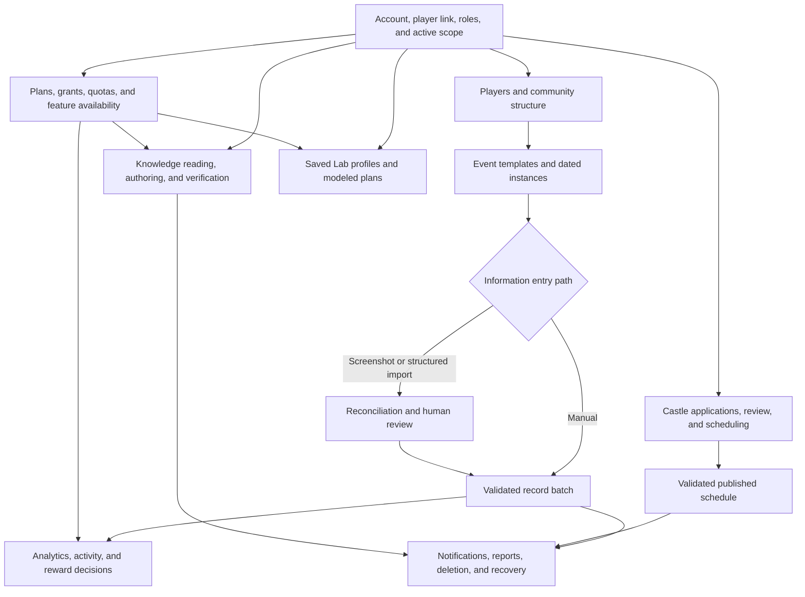

# Kingshot Events
Kingshot Events helps communities keep player and event information structured across kingdoms and alliances. It combines data entry, review, reporting, Castle Position coordination, shared knowledge, and planning tools. Automation assists some tasks, but contributors and managers still review important information.

<ProductFinder />

## Explore by product area

<LinkGrid :items='[
  {"title":"Getting Started","description":"Identity, player link, scope, and a useful first task.","href":"/kingshot-events/getting-started/"},
  {"title":"Accounts and Access","description":"Approval, roles, assignments, availability, grants, and access outcomes.","href":"/kingshot-events/accounts-and-access/"},
  {"title":"Scopes and Communities","description":"Server, kingdom, alliance, player hierarchy, and cross-scope visibility.","href":"/kingshot-events/scopes-and-communities/"},
  {"title":"Players","description":"Directory, identity, linking, sync, status, membership, removal, and restore.","href":"/kingshot-events/players/"},
  {"title":"Events and Results","description":"Templates, instances, dates, stages, batches, locks, and corrections.","href":"/kingshot-events/events/"},
  {"title":"Imports and Data Entry","description":"Manual, screenshot, and structured entry with reconciliation and rollback.","href":"/kingshot-events/imports/"},
  {"title":"Analytics and Rewards","description":"Kingdom, alliance, player, and custom views plus reward decisions.","href":"/kingshot-events/analytics/"},
  {"title":"Castle Positions","description":"Applications, review, candidate logic, planning, publication, and changes.","href":"/kingshot-events/castle-positions/"},
  {"title":"Knowledge Hub","description":"Reading access, translation, authoring, review, revisions, and verification.","href":"/kingshot-events/knowledge-hub/"},
  {"title":"Simulations and Optimizations","description":"Saved profiles, progression optimizers, Bear Trap, and result limits.","href":"/kingshot-events/lab/"},
  {"title":"Subscriptions and Usage","description":"Plans, accepted grants, allocations, quotas, limited mode, and suspension.","href":"/kingshot-events/subscriptions/"},
  {"title":"Shared Lifecycles","description":"Notifications, reports, deletion, recycle bin, and restoration.","href":"/kingshot-events/lifecycles/recycle-bin-and-restore-requests"},
  {"title":"Role Journeys","description":"Task paths shaped around player, alliance, kingdom, editorial, and session roles.","href":"/kingshot-events/role-journeys/player-or-member"},
  {"title":"Troubleshooting","description":"Symptoms, safe checks, recovery, and support evidence.","href":"/kingshot-events/troubleshooting/"},
  {"title":"Updates","description":"User-facing changes and documentation impact.","href":"/kingshot-events/updates/release-notes"}
]' />

## Choose your role

<LinkGrid :items='[
  {"title":"Player or member","description":"Profile, personal results, rewards, applications, articles, and Lab tools.","href":"/kingshot-events/role-journeys/player-or-member"},
  {"title":"Alliance leader","description":"Roster, entry, imports, corrections, Analytics, and rewards.","href":"/kingshot-events/role-journeys/alliance-leader"},
  {"title":"Co-leader","description":"Delegated alliance tasks and leader handoff boundaries.","href":"/kingshot-events/role-journeys/co-leader"},
  {"title":"King or kingdom manager","description":"Cross-alliance views, shared access, and kingdom workflows.","href":"/kingshot-events/role-journeys/kingdom-manager"},
  {"title":"Minister of Justice","description":"Castle applications, conflicts, schedule drafts, and publication.","href":"/kingshot-events/role-journeys/minister-of-justice"},
  {"title":"Knowledge author or reviewer","description":"Drafts, blocks, review decisions, publication, and revisions.","href":"/kingshot-events/role-journeys/knowledge-author"},
  {"title":"Reading-session manager","description":"Assignments, progress, classification, reports, close, and archive.","href":"/kingshot-events/role-journeys/reading-session-manager"}
]' />

## Problems it helps solve

- Maintain player records without relying on scattered sheets and message threads.
- Collect participation or score information through manual entry and supported screenshot imports.
- Review activity, event history, and reward eligibility in the correct scope.
- Coordinate Castle Position applications, decisions, schedules, and publication.
- Share structured guides through Knowledge Hub.
- Compare modeled progression choices in the Lab without treating estimates as guaranteed outcomes.

## How the parts work together

*Complete Kingshot Events product map. Identity and scope feed records and specialized workflows; subscriptions affect feature access; shared lifecycles preserve downstream state and recovery.*

**Accessible summary:** Account and scope lead to player, event, Castle, Knowledge, and Lab workflows. Reviewed batches feed Analytics and rewards, subscriptions affect availability, and shared lifecycles handle notices and recovery.

Player information belongs to an alliance and kingdom context. Event results connect a player to a configured event occurrence. Reviews and reports use that same context so authorized users see the intended community data.

Information enters the platform through manager forms, manual result entry, spreadsheet or screenshot imports, Castle Position applications, Knowledge drafts, and Lab profiles. Each path has its own review boundary. Import rows are proposals until accepted, Castle Position applications are requests until reviewed and published, Knowledge edits remain drafts until publication, and Lab inputs remain planning assumptions until the user confirms them.

After review, the same scoped records support downstream work:

- Saved player and event results feed player history, alliance and kingdom Analytics, activity status, and reward eligibility.
- Reviewed Castle Position applications feed the candidate workspace and draft planner; publication produces the participant schedule.
- Published Knowledge revisions become searchable for their intended public, kingdom, alliance, or premium audience.
- Saved Lab profiles supply consistent inputs to progression and combat modules, but never update the game account.

## Where to begin

| You want to... | Start here | Then continue to... |
| --- | --- | --- |
| Join and find your personal information | [Your First Visit](/kingshot-events/getting-started/first-visit) | Account profile, player link, My Analytics, rewards, or appointments |
| Maintain an alliance roster | [Player Directory](/kingshot-events/players/directory-and-profiles) | Add or sync players, lifecycle actions, then alliance analytics |
| Record an event | [Event Tracking](/kingshot-events/events/overview) | Manual entry or screenshot import, review, history, analytics, and rewards |
| Coordinate Castle Positions | [Castle Positions](/kingshot-events/castle-positions/) | Applicant or review guide, planner, publication, and participant changes |
| Read or publish a guide | [Knowledge Hub reading](/kingshot-events/knowledge-hub/reading-and-finding) | Access, Reading Verification, or Studio authoring |
| Compare progression or combat choices | [Lab Overview](/kingshot-events/lab/) | Select a profile, complete inputs, run a module, and review limitations |

## Review and correction are part of the workflow

The product keeps source context so managers can trace a value. A result can lead back to an event instance, import, or record batch. An analytics surprise should be corrected at that source. A schedule change should be saved and published through Castle Positions. A Knowledge correction should become a reviewed revision. A Lab result should be rerun from a corrected profile. Avoid creating a second player, event instance, application, article, or profile merely to hide a correction problem.

## Who uses the platform

- Players and alliance members view personal activity, rewards, appointments, guides, and available tools.
- Alliance leaders and co-leaders maintain alliance information and review scoped contributions.
- Kings, kingdom managers, and Ministers of Justice coordinate kingdom-wide workflows such as Castle Positions.
- Knowledge authors prepare articles for review and publication.

<RolePerspective>

### As a player

Begin with your profile, active scope, personal analytics, rewards, and any application links shared with you.

### As a community manager

Confirm the active kingdom or alliance before reviewing players, events, imports, rewards, or schedules.

### What the platform does automatically

It applies scope and access rules, preserves workflow states, and presents supported summaries. It does not remove the need to check imported information or modeled results.

</RolePerspective>

<VisualReference title="Kingshot Events orientation">
The main navigation changes with your access and with feature availability.

<template #items>

- Confirm the selected kingdom or alliance near the top of the workspace.
- Use Workspace for records and events, Input for contributions, and Discover for Knowledge Hub and Lab tools.
- Use profile and support areas when your expected scope or feature is missing.

</template>
</VisualReference>

## Related guides

- [first visit](/kingshot-events/getting-started/first-visit)
- [platform model](/kingshot-events/overview/platform-model)
